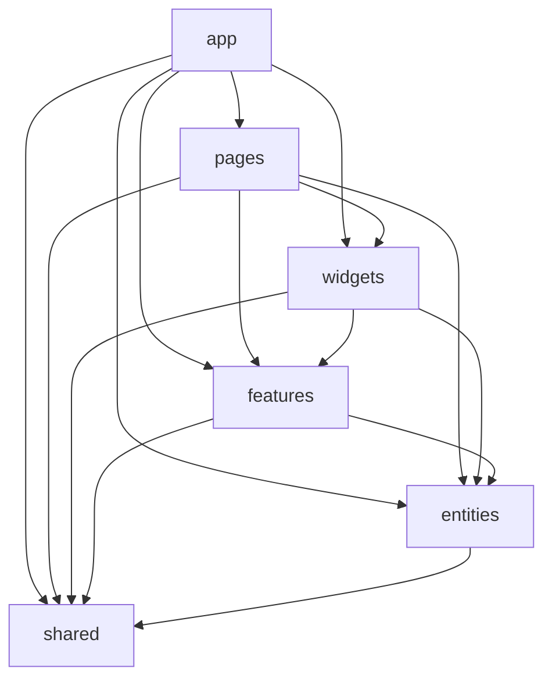
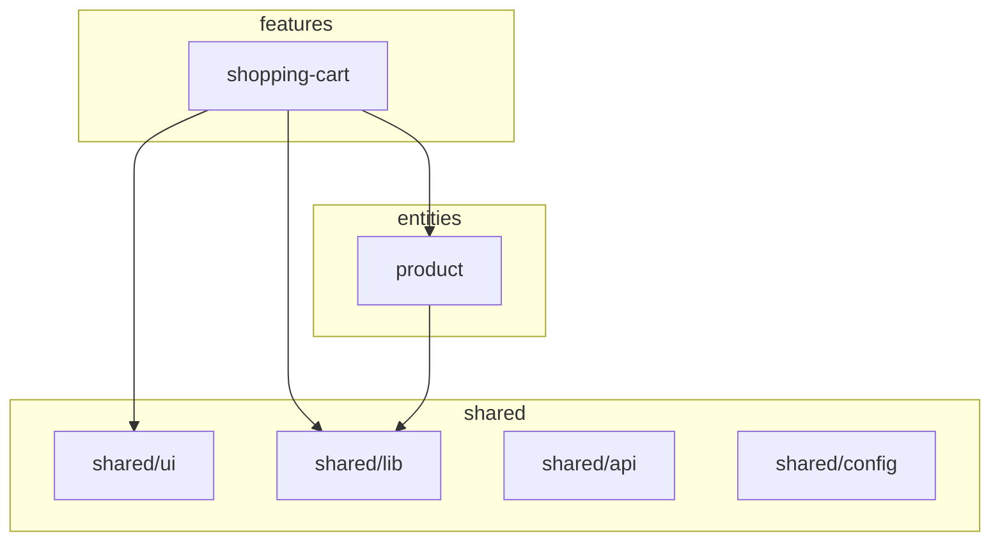

# Architecture

## System Patterns

This project follows **Feature-Sliced Design (FSD)** — a frontend architectural methodology that organizes code into layers and slices with strict dependency rules.

### Layer Hierarchy

Layers are ordered by level of abstraction. Each layer may only import from layers **below** it. Horizontal imports within the same layer are forbidden (except `shared`).

```
app → pages → widgets → features → entities → shared
```

| Layer | Responsibility | May import from |
|-------|---------------|-----------------|
| `app` | Providers, routing, global styles | pages, widgets, features, entities, shared |
| `pages` | Route-level composition | widgets, features, entities, shared |
| `widgets` | Self-contained UI blocks | features, entities, shared |
| `features` | User interactions with business logic | entities, shared |
| `entities` | Business objects and data shapes | shared |
| `shared` | Reusable, business-agnostic infrastructure | nothing (leaf layer) |

### Slice Isolation

Each slice (e.g., `features/shopping-cart`, `entities/product`) is a self-contained module:

- **Public API:** Every slice exposes a single `index.ts`. All cross-boundary imports go through it.
- **Internal structure:** `ui/`, `model/`, `api/` — these folders are private. Direct imports into them from outside the slice are forbidden.
- **No cross-slice imports:** `features/A` cannot import from `features/B`. Shared logic moves down to `entities` or `shared`.
- **Exception — `shared` layer:** Segments within `shared` may import from each other (e.g., `shared/ui` can use `shared/lib`). This is the only layer where cross-segment imports are allowed.

## Tech Stack

| Tool | Purpose |
|------|---------|
| Vite 8 | Build tool, dev server |
| React 19 | UI library |
| TypeScript 5.9 | Type safety |
| Tailwind CSS v4 | Utility-first styling (Day 4) |
| ESLint 9 (flat config) | Linting + custom FSD rules (Day 3) |

## Data Flow

```
Request:  Feature/Page → Entity API handler → shared/api (HTTP client) → External API
Response: External API → shared/api → Entity API handler → Entity state → Feature/Page (reads)
```

- **Request initiation:** Features or Pages initiate data fetching by calling API handlers defined in Entities (or their own `api/` segment).
- **State ownership:** Each entity owns its data shape. Features orchestrate entity state for user interactions.
- **Props flow down** through the layer hierarchy: pages → widgets → features → entities → shared.
- **No global store yet.** State is local to components. When a store is introduced, it will live in `entities/<slice>/model/`.
- **API layers:** `shared/api` contains only the HTTP client instance and base request helpers. Domain-specific API handlers (e.g., `getProducts()`) live inside the `api/` segment of the corresponding slice (`entities/product/api/`, `features/shopping-cart/api/`).
- **Type placement:** Business-domain types (e.g., `Product`, `CartItem`) live in `entities/<slice>/model/types.ts`. Generic utility types (e.g., `ApiResponse`, `Nullable`) live in `shared/lib/`.

## Definition of Done (Architectural)

A change is architecturally complete when:

- [ ] `npm run lint` exits with 0 errors
- [ ] `npm run build` exits with 0 errors
- [ ] No FSD layer violations (enforced by lint rules — Day 3)
- [ ] No cross-slice imports (enforced by lint rules — Day 3)
- [ ] All public APIs go through `index.ts` (enforced by lint rules — Day 3)
- [ ] Architecture graph matches actual imports (enforced by CI — Day 5)

> **Note:** Test coverage and CI pipeline are not yet in place. This DoD will grow as the harness evolves.

## Repository Intelligence Graph

The dependency graph below represents the **intended** architecture. Starting from Day 5, a CI script (`validate-architecture.ts`) will generate this graph from actual imports and fail if it diverges from the documented structure.



### Slice-Level Graph (Current)


