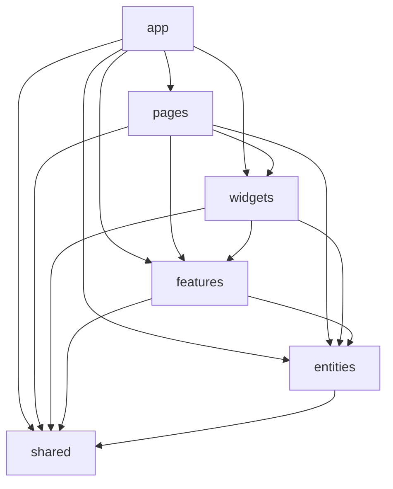
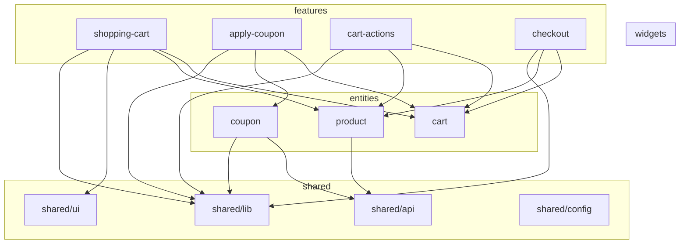

# Architecture

## Tech Stack

| Tool                   | Purpose                    |
| ---------------------- | -------------------------- |
| Vite 8                 | Build tool, dev server     |
| React 19               | UI library                 |
| TypeScript 5.9         | Type safety                |
| Tailwind CSS v4        | Utility-first styling      |
| ESLint 9 (flat config) | Linting + custom FSD rules |

## Data Flow

```
Request:  Feature/Page → Entity API handler → shared/api (HTTP client) → External API
Response: External API → shared/api → Entity API handler → Entity state → Feature/Page (reads)
```

- **Request initiation:** Features or Pages initiate data fetching by calling API handlers defined in Entities (or their own `api/` segment).
- **State ownership:** Each entity owns its data shape. Features orchestrate entity state for user interactions.
- **Props flow down** through the layer hierarchy: pages → widgets → features → entities → shared.
- **No global store yet.** State is local to components. When a store is introduced, it will live in `entities/<slice>/model/`.
- **API layers:** `shared/api` contains only the HTTP client instance and base request helpers. Domain-specific API handlers (e.g., `getProducts()`) live inside the `api/` segment of the corresponding slice (`entities/product/api/`, `features/shopping-cart/api/`).
- **Type placement:** Business-domain types (e.g., `Product`, `CartItem`) live in `entities/<slice>/model/types.ts`. Generic utility types (e.g., `ApiResponse`, `Nullable`) live in `shared/lib/`.

## Definition of Done (Project-Level)

A change is complete when:

- [ ] `npm run lint` exits with 0 errors
- [ ] `npm run build` exits with 0 errors

> **Note:** FSD-specific architectural rules (layer violations, cross-slice imports, public API) are enforced via the `fsd-architecture` skill and checked by `npm run lint:arch`.

## Repository Intelligence Graph

The dependency graph below represents the **intended** architecture. A CI script (`validate-architecture.ts`) generates this graph from actual imports and fails if it diverges from the documented structure.


```mermaid
graph TD
    app --> pages
    app --> widgets
    app --> features
    app --> entities
    app --> shared

    pages --> widgets
    pages --> features
    pages --> entities
    pages --> shared

    widgets --> features
    widgets --> entities
    widgets --> shared

    features --> entities
    features --> shared

    entities --> shared
```

### Slice-Level Graph (Current)


```mermaid
graph TD
    subgraph widgets
    end

    subgraph features
        shopping-cart
        apply-coupon
        cart-actions
        checkout
    end

    subgraph entities
        product
        cart
        coupon
    end

    subgraph shared
        shared/ui
        shared/lib
        shared/api
        shared/config
    end

    shopping-cart --> cart
    shopping-cart --> product
    shopping-cart --> shared/ui
    shopping-cart --> shared/lib
    apply-coupon --> cart
    apply-coupon --> coupon
    apply-coupon --> shared/lib
    cart-actions --> cart
    cart-actions --> product
    cart-actions --> shared/lib
    checkout --> cart
    checkout --> product
    checkout --> shared/lib
    product --> shared/api
    coupon --> shared/api
    coupon --> shared/lib
```
