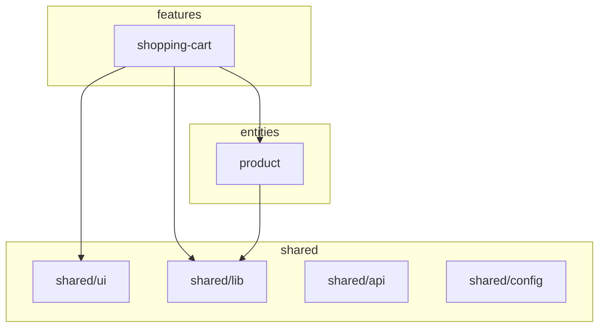

# Project Plan: Harness Engineering

## What This Project Is

A **learning project** for studying **Harness Engineering** — the discipline of building self-enforcing repositories where AI agents (and humans) produce correct code through tooling constraints, not memorization or good intentions.

The shopping cart app is just the test payload. The real product is the **harness**: the combination of linters, type checks, architecture validators, CI pipelines, and conventions that make it structurally impossible to write incorrect code without immediate feedback.

### Core Principle

> Every rule must be binary (violated or not), syntax-verifiable, and locally checkable. If a rule can't be enforced by a tool, it's a guideline at best.

### Who Is Building This

Pavel (Senior Software Engineer) — researching how to design environments that force any agent to converge on correct output. The collaboration model: Pavel drives architecture decisions and research, Claude critiques, implements boilerplate, and validates.

---

## 6-Day Curriculum

### Day 1: Theory ✅

Studied Harness Engineering concepts: self-enforcing repos, machine-enforceable rules, the difference between a harness and documentation.

### Day 2: Scaffold ✅

Built the FSD (Feature-Sliced Design) project skeleton:

- **FSD folder structure** — `app/`, `pages/`, `widgets/`, `features/`, `entities/`, `shared/` with proper segments (`ui/`, `model/`, `api/`, `lib/`, `config/`)
- **ARCHITECTURE.md** — layer hierarchy, slice isolation rules, data flow, dependency graph (Mermaid), definition of done
- **CONVENTIONS.md** — machine-enforceable rules only. Every rule tagged with its enforcement tool (`[steiger]`, `[eslint]`, `[prettier]`, `[review]`, `[ci-custom]`)
- **AGENTS.md** — vendor-agnostic instructions for AI coding agents. Root-level + per-layer AGENTS.md files with layer-specific context
- **README.md** — project overview, quick start, commands
- **Path alias** `@/` → `src/` configured in Vite + TypeScript

**Key artifacts:**

- `src/` — FSD folder tree with `entities/product/` and `features/shopping-cart/` slices
- `ARCHITECTURE.md`, `CONVENTIONS.md`, `AGENTS.md` — the three pillars of harness documentation
- Per-layer `AGENTS.md` files in each `src/<layer>/`

### Day 3: Linting + Automation ✅

Built the automated enforcement layer — three lines of defense:

**Steiger (FSD architecture linter):**

- `steiger.config.ts` — FSD recommended rules, `insignificant-slice` disabled (empty project)
- Enforces: no-higher-level-imports, no-cross-imports, public-api, segments-by-purpose
- Command: `npm run lint:arch`

**ESLint 9 (flat config):**

- `import/no-default-export` — named exports only (CONVENTIONS 2.1)
- `react/no-unstable-nested-components` — no nested components (CONVENTIONS 2.3)
- `no-restricted-imports` with `../../*` pattern — import locality (CONVENTIONS 1.4)
- `no-restricted-syntax` for `className` in custom `shared/ui/` (CONVENTIONS 3.2)
- Exceptions: config files allowed `export default`, `shared/ui/shadcn/` exempted from className ban
- Command: `npm run lint`

**Automation pipeline (Defense in Depth):**

1. **Pre-commit** (Husky + lint-staged): ESLint on staged `.ts/.tsx` files + Prettier formatting. ~1-3 seconds.
2. **Pre-push** (Husky): Steiger + TypeScript build on whole project. ~5-15 seconds.
3. **CI** (GitHub Actions): Clean-room `npm ci` → Prettier check → ESLint → Steiger → build. ~30-60 seconds.

**Key artifacts:**

- `.husky/pre-commit`, `.husky/pre-push`
- `.github/workflows/ci.yml`
- `docs/automation-pipeline.md` — detailed docs with diagrams and scenarios
- `eslint.config.js`, `steiger.config.ts`

### Day 4: Tailwind + shadcn ✅

Integrated styling toolchain:

**Tailwind CSS v4:**

- CSS-first config (no `tailwind.config.js`) — `@import 'tailwindcss'` in `src/index.css`
- `@tailwindcss/vite` plugin
- Utility-first convention (CONVENTIONS 3.1)

**Prettier + tailwind class sorting:**

- `prettier-plugin-tailwindcss` — automatic class ordering
- `.prettierrc.json` — single quotes, no semicolons, trailing commas
- `npm run format` / `npm run format:check`
- Integrated into lint-staged (pre-commit) and CI

**shadcn/ui:**

- Configured for FSD paths: `components.json` → `@/shared/ui/shadcn/`
- `cn()` utility in `shared/lib/utils.ts` (clsx + tailwind-merge)
- Button component as first shadcn component (cva variants)
- Dependencies: `class-variance-authority`, `clsx`, `tailwind-merge`, `@base-ui/react`, `lucide-react`

**Zero-trust styling (pragmatic approach):**

- Directory split: `shared/ui/shadcn/` (className allowed) vs `shared/ui/*.tsx` (className forbidden by ESLint)
- shadcn components use `cva` + TypeScript union types as their harness
- Custom components use ESLint `no-restricted-syntax` to ban `className`
- Documented in CONVENTIONS.md 3.2

**Key artifacts:**

- `src/shared/ui/shadcn/button.tsx` — first shadcn component
- `src/shared/lib/utils.ts` — `cn()` utility
- `components.json` — shadcn CLI config pointing to FSD paths
- `.prettierrc.json`, `.prettierignore`

### Day 4.5: Storybook ✅

**Goal:** Add a component registry that agents can use to discover available UI primitives. Storybook also opens the door to visual feedback loops (Week 4 of the 7-week plan).

**What needs to be done:**

1. **Install Storybook** — `npx storybook@latest init`. It will detect Vite + React and configure itself. Verify it runs with `npm run storybook`.
2. **Configure for FSD** — stories live next to components. For `shared/ui/shadcn/button.tsx`, create `shared/ui/shadcn/button.stories.tsx`. For custom components in `shared/ui/`, same pattern.
3. **Write first story** — a story for the Button component showcasing all variants (default, outline, secondary, ghost, destructive, link) and sizes (xs, sm, default, lg, icon). This becomes the visual contract.
4. **Add `storybook` and `build-storybook` scripts** to `package.json`.
5. **ESLint exception** — story files (`*.stories.tsx`) need `export default` (Storybook's CSF format requires it). Add to the existing config files exception in `eslint.config.js`.
6. **Steiger** — `.stories.tsx` files inside slice folders may trigger warnings. Test and add ignores to `steiger.config.ts` if needed.
7. **Optional: Storybook MCP** — if time permits, configure the Storybook MCP server so agents can query the component registry from context. This is the "component inventory as context" pattern from Week 3 of the 7-week plan.

**Why this matters for the harness:**

- Agents can discover what UI components exist without scanning files
- Stories serve as visual documentation that agents can reference
- Opens path to visual regression testing (Chromatic/Percy) — the visual feedback loop from Week 4
- Storybook MCP (future) gives agents structured component API data instead of raw source code

**Estimated effort:** ~15 minutes for basic setup, ~30 minutes with stories and ESLint config.

### Day 4.6: Storybook Harness Integration ✅

Added Storybook as a harness layer:

- **Story-First Convention** — AGENTS.md: story before component, CSF3 format, bug-first pattern
- **build-storybook as CI gate** — `.github/workflows/ci.yml` and `.husky/pre-push` now run Storybook build
- **ESLint exceptions** — `.storybook/` configs and `*.stories.tsx` files exempt from `no-default-export`

**Key artifacts:**

- `src/shared/AGENTS.md` — story-first + bug-first conventions
- `AGENTS.md` (root) — workflow updated with Storybook steps
- `.github/workflows/ci.yml` — `build-storybook` step added
- `.husky/pre-push` — `build-storybook` appended after build

### Day 5: Architecture Validator ✅

**Goal:** Make documentation executable. The dependency graph in `ARCHITECTURE.md` must match actual imports in the codebase. Any divergence fails CI.

**Why this matters:** This is the capstone of the harness. Steiger catches FSD rule violations, ESLint catches code patterns, but `validate-architecture.ts` catches **architectural drift** — when the codebase slowly diverges from the intended design. It turns ARCHITECTURE.md from a wish-list into an executable contract.

---

#### Step 1: Install `tsx`

```bash
npm install -D tsx
```

`tsx` runs TypeScript files directly without pre-compilation. Needed for `scripts/validate-architecture.ts`.

#### Step 2: Create `scripts/validate-architecture.ts`

Create the file `scripts/validate-architecture.ts`. It does three things:

**2a. Parse the intended graph from ARCHITECTURE.md**

Read `ARCHITECTURE.md`, find the **Slice-Level Graph** (the second `mermaid` block — the one with `subgraph` statements). Parse edges like `shopping-cart --> product` into a Set of `"source -> target"` strings.

Current Mermaid block to parse (see `ARCHITECTURE.md:99-120`):



Parsing rules:

- Skip lines with `graph TD`, `subgraph`, `end`, and lines inside subgraph blocks (node declarations)
- Extract edges: `A --> B` → `{ source: "A", target: "B" }`
- Ignore the layer-level graph (first Mermaid block) — it's a generic FSD diagram, not project-specific

**2b. Build actual graph from imports**

Scan all `*.ts` and `*.tsx` files in `src/` (excluding `*.stories.tsx`, `*.test.ts`, `*.d.ts`, `AGENTS.md`).

**IMPORTANT: Use TypeScript Compiler API for import extraction, NOT regex.** Regex breaks on multi-line imports, commented-out imports, and string literals containing `from`. Use `ts.createSourceFile()` to parse each file into AST, then walk `ImportDeclaration` nodes to extract module specifiers. TypeScript is already in our deps — no new dependencies needed.

**IMPORTANT: Read path aliases from `tsconfig.json`** (`compilerOptions.paths`), do not hardcode the `@/ → src/` mapping. This keeps a single source of truth for alias resolution.

For each file:

1. Determine which slice it belongs to: `src/features/shopping-cart/ui/Button.tsx` → `shopping-cart`
2. Parse the file with `ts.createSourceFile()`, walk `ts.SyntaxKind.ImportDeclaration` nodes, extract `moduleSpecifier` text
3. For each import:
   - **Relative** (`./`, `../`) → intra-slice, skip
   - **Absolute** (`@/shared/ui`, `@/entities/product`) → resolve alias via tsconfig paths, then map to target slice:
     - `@/shared/ui` → `shared/ui`
     - `@/shared/lib` → `shared/lib`
     - `@/shared/api` → `shared/api`
     - `@/shared/config` → `shared/config`
     - `@/entities/product` → `product`
     - `@/features/shopping-cart` → `shopping-cart`
   - Rule: for `shared`, use `shared/<segment>` as the node name. For other layers, use just the slice name.
4. Build Set of `"source -> target"` strings (same format as intended graph)

**2c. Compare and report**

Compare the two sets:

```
undocumented = actual - intended   (imports exist but not in ARCHITECTURE.md)
stale        = intended - actual   (edges in ARCHITECTURE.md but no imports back them up)
```

**Output format:**

```
✅ Architecture graph matches imports (N edges verified)
```

or:

```
❌ Architecture graph mismatch:

UNDOCUMENTED DEPENDENCIES (import exists, missing from ARCHITECTURE.md):
  shopping-cart --> shared/config

STALE DOCUMENTATION (in ARCHITECTURE.md, no import found):
  product --> shared/lib

Run: update ARCHITECTURE.md to match actual imports, or fix the imports.
```

Exit code: 0 if both sets empty, 1 otherwise.

#### Step 3: Handle edge cases

These MUST be handled in the script:

| Case                                                                    | How to handle                                                                                                                                                          |
| ----------------------------------------------------------------------- | ---------------------------------------------------------------------------------------------------------------------------------------------------------------------- |
| Intra-slice relative imports (`./store`, `../model/types`)              | Skip — not cross-slice                                                                                                                                                 |
| `shared` internal imports (`shared/ui` → `shared/lib`)                  | Skip — shared segments can import each other (ARCHITECTURE.md §Slice Isolation)                                                                                        |
| Empty slices (only `index.ts` + `.gitkeep`)                             | Don't generate edges for empty re-exports (`export {}`)                                                                                                                |
| `index.ts` re-exports (`export { Button } from './shadcn/button'`)      | These are intra-slice, skip                                                                                                                                            |
| Story files (`*.stories.tsx`)                                           | Exclude from scanning — stories import the component they test, this is not an architectural dependency                                                                |
| Test files (`*.test.ts`, `*.spec.ts`)                                   | Exclude from scanning                                                                                                                                                  |
| Type-only imports (`import type { X } from ...`)                        | INCLUDE — type dependencies are still architectural dependencies                                                                                                       |
| Non-`@/` absolute imports (`react`, `clsx`, etc.)                       | Skip — external packages, not part of FSD graph                                                                                                                        |
| Cross-imports within same layer (`features/cart` → `features/checkout`) | Report as **undocumented dependency** — such an edge can never be in the graph (FSD forbids it). Steiger also catches this, but our script should too for completeness |

#### Step 4: Add npm script

In `package.json`, add:

```json
"validate:arch": "tsx scripts/validate-architecture.ts"
```

Verify it works:

```bash
npm run validate:arch
```

Expected: should pass (current graph matches current imports — slices are mostly empty, so few/no actual edges).

#### Step 5: Add to CI pipeline

Edit `.github/workflows/ci.yml`. Add after the Steiger step, before build:

```yaml
- name: Validate architecture graph
  run: npm run validate:arch
```

Full step order should be: Prettier → ESLint → Steiger → **validate:arch** → build → build-storybook.

#### Step 6: Add to pre-push hook

Edit `.husky/pre-push`. Current content:

```bash
npm run lint:arch && npm run build && npm run build-storybook
```

Change to:

```bash
npm run lint:arch && npm run validate:arch && npm run build && npm run build-storybook
```

#### Step 7: Update CONVENTIONS.md

In CONVENTIONS.md §4 (Structural Rules):

- §4.1 "Every Slice Has a Public API" — keep `[ci-custom]` tag, add: "Enforced by `npm run validate:arch` (`scripts/validate-architecture.ts`)."
- §4.2 "Architecture Graph Matches Imports" — keep `[ci-custom]` tag, add: "Enforced by `npm run validate:arch`. Two error types: undocumented dependency (import exists, edge missing) and stale documentation (edge exists, no import)."

#### Step 8: Test with intentional violations

**Test 1 — Undocumented dependency:**
Add a temporary import in `src/features/shopping-cart/index.ts`:

```ts
import { something } from '@/shared/config'
```

Run `npm run validate:arch` → should report `shopping-cart --> shared/config` as undocumented.
Remove the import after testing.

**Test 2 — Stale documentation:**
Add a temporary edge in ARCHITECTURE.md slice graph:

```
product --> shared/api
```

Run `npm run validate:arch` → should report `product --> shared/api` as stale.
Remove the edge after testing.

**Test 3 — Clean run:**
After removing test violations, run `npm run validate:arch` → should exit 0.

#### Step 9: Final verification

Run all checks in sequence:

```bash
npm run format:check && npm run lint && npm run lint:arch && npm run validate:arch && npm run build && npm run build-storybook
```

All must exit 0.

**Referenced in:**

- CONVENTIONS.md §4.1 (every slice has public API) — `[ci-custom]` tag
- CONVENTIONS.md §4.2 (graph matches imports) — `[ci-custom]` tag
- ARCHITECTURE.md "Definition of Done" and "Repository Intelligence Graph"

**Estimated effort:** ~1-2 hours.

**Key artifacts:**

- `scripts/validate-architecture.ts` — parses Mermaid graph, extracts imports via TypeScript AST, compares and reports
- `package.json` — `validate:arch` script added
- `.github/workflows/ci.yml` — `validate:arch` step added (between Steiger and build)
- `.husky/pre-push` — `validate:arch` added between `lint:arch` and `build`
- `CONVENTIONS.md` — §4.1/§4.2 updated with implementation details

---

### Day 6: Agent Test Drive ⏳

**Goal:** Validate the entire harness by having an AI agent build real features in the shopping cart, guided only by the repo's documentation and tooling. The agent knows nothing about FSD — it learns from the repo.

**Success criteria:** An agent with no prior FSD knowledge, reading only the repo's docs and tool output, produces architecturally correct code on the first or second try.

---

#### Step 1: Prepare the repo for the test

**1a. Clean App.tsx**

Replace current `src/App.tsx` (Vite template) with a minimal shell:

```tsx
export const App = () => {
  return (
    <div className="bg-background text-foreground min-h-screen">
      <h1 className="p-8 text-2xl font-bold">FSD Shopping Cart</h1>
    </div>
  )
}
```

No router yet — the agent can add one if needed.

**1b. Verify clean state**

```bash
npm run format:check && npm run lint && npm run lint:arch && npm run validate:arch && npm run build && npm run build-storybook
```

All exit 0. Commit this as "chore: prepare clean slate for agent test drive".

#### Step 2: Write the feature brief

Create `docs/agent-test-brief.md`:

```markdown
# Agent Test Brief

You are given a React + TypeScript project that follows Feature-Sliced Design.
Read AGENTS.md and ARCHITECTURE.md before writing any code.

## Task 1: Product Entity

Create the `entities/product` slice:

- Type: `Product` with fields `id`, `name`, `price` (number), `image` (string URL)
- Mock data: array of 6 products in `entities/product/api/`
- UI: `ProductCard` component showing image, name, and price
- Story: `ProductCard.stories.tsx` with Default and all meaningful states
- Public API: export type, mock data, and component from `index.ts`

## Task 2: Shopping Cart Feature

Create the `features/shopping-cart` slice:

- State: `CartItem` type (`product: Product`, `quantity: number`), store using React Context or Zustand
- UI: `AddToCartButton` component (uses shadcn Button, accepts `productId`)
- UI: `CartIcon` component showing item count badge
- Story: stories for both components
- Public API: export components and cart actions from `index.ts`

## Task 3: Pages

Create two pages in `pages/`:

- `HomePage`: grid of ProductCards, each with AddToCartButton
- `CartPage`: list of cart items with quantities, remove button, total price

## Task 4: App Shell

Wire pages into `App.tsx`:

- Simple client-side routing (react-router or manual state)
- Header with navigation and CartIcon
- Layout using Tailwind

## Rules

- Follow the workflow in AGENTS.md exactly
- Run all lint/build commands after EACH file you create
- Do NOT skip the story-first convention for shared/ui components
- If a linter fails, read the error, fix it, and re-run
```

#### Step 3: Run Agent #1 (Claude Code)

Open a **new** Claude Code session in this repo (fresh context, no memory of previous work).

Give it the brief:

```
Read docs/agent-test-brief.md and implement all 4 tasks. Follow the repo's AGENTS.md workflow exactly.
```

**Do NOT help the agent.** Let it figure things out from the repo docs and linter output. Only intervene if it's stuck in an infinite loop (>5 iterations on the same error).

#### Step 4: Observe and log

While the agent works, track in `docs/agent-test-log.md`:

```markdown
# Agent Test Log

## Agent: Claude Code (session date: YYYY-MM-DD)

### Observation Checklist

| Question                                 | Answer |
| ---------------------------------------- | ------ |
| Did it read AGENTS.md first?             | yes/no |
| Did it read ARCHITECTURE.md?             | yes/no |
| Did it follow story-first for shared/ui? | yes/no |
| Did it create index.ts for each slice?   | yes/no |
| Did it run lint after each file?         | yes/no |
| Did it run lint:arch?                    | yes/no |
| Did it run build?                        | yes/no |

### Harness Catches (where tooling corrected the agent)

| Mistake                | Caught by | Rule                     | Iterations to fix |
| ---------------------- | --------- | ------------------------ | ----------------- |
| (e.g., default export) | ESLint    | import/no-default-export | 1                 |

### Harness Misses (mistakes NOT caught by tooling)

| Mistake                         | Should be caught by | Proposed fix             |
| ------------------------------- | ------------------- | ------------------------ |
| (e.g., domain logic in shared/) | AGENTS.md guidance  | Improve shared/AGENTS.md |

### Metrics

- Files created: N
- First-attempt lint pass rate: X/N (Y%)
- Total lint→fix cycles: N
- Total build→fix cycles: N
- Final state: all checks green? yes/no
```

#### Step 5: Tighten the harness

Based on the log, fix gaps:

| Observed problem                          | Fix                                                                            |
| ----------------------------------------- | ------------------------------------------------------------------------------ |
| Agent didn't read AGENTS.md               | Add instruction to CLAUDE.md: "ALWAYS read AGENTS.md before first edit"        |
| Agent put component in wrong layer        | Improve per-layer AGENTS.md with more examples                                 |
| Agent used wrong import pattern           | Add/tighten ESLint rule                                                        |
| Agent created files outside FSD structure | Add Steiger rule or glob constraint                                            |
| Agent skipped story-first                 | Make `build-storybook` fail when component has no story (future: custom check) |
| Agent used `export default`               | Already caught by ESLint — verify it worked                                    |

Commit harness improvements as "fix: tighten harness based on agent test drive".

#### Step 6: Run Agent #2 (different vendor)

Repeat Steps 3-4 with a different agent (Cursor, GPT-4 via Copilot, Windsurf, etc.) on the **same repo** (after reverting agent #1's code but keeping harness improvements).

```bash
git stash   # or create a branch for agent #1's work
```

Goal: verify the harness is **vendor-agnostic**. If agent #2 makes different mistakes, tighten further.

#### Step 7: Final report

Update `docs/agent-test-log.md` with a comparison table:

```markdown
## Summary

| Metric                  | Claude Code | Agent #2 |
| ----------------------- | ----------- | -------- |
| Read AGENTS.md first?   | yes/no      | yes/no   |
| First-attempt pass rate | X%          | X%       |
| Lint→fix cycles         | N           | N        |
| Harness catches         | N/M (X%)    | N/M (X%) |
| All checks green?       | yes/no      | yes/no   |
```

And a conclusions section: what worked, what didn't, what to add to the harness.

**Estimated effort:** ~2-3 hours (agent runs + observation + harness tightening).

---

## Current State (as of 2026-04-07)

### All checks pass

```
npm run format:check  ✅  Prettier
npm run lint          ✅  ESLint
npm run lint:arch     ✅  Steiger
npm run build         ✅  TypeScript + Vite
```

### File structure

```
src/
├── app/
│   ├── AGENTS.md
│   └── index.ts
├── pages/
│   └── AGENTS.md
├── widgets/
│   └── AGENTS.md
├── features/
│   ├── AGENTS.md
│   └── shopping-cart/
│       ├── ui/.gitkeep
│       ├── model/.gitkeep
│       └── index.ts
├── entities/
│   ├── AGENTS.md
│   └── product/
│       ├── ui/.gitkeep
│       ├── model/.gitkeep
│       └── index.ts
└── shared/
    ├── AGENTS.md
    ├── ui/
    │   ├── shadcn/
    │   │   └── button.tsx
    │   └── index.ts
    ├── lib/
    │   ├── utils.ts       (cn() utility)
    │   └── index.ts
    ├── api/
    │   └── index.ts
    └── config/
        └── index.ts
```

### Enforcement layers

| Layer            | Tool                       | Config                             | Command                                   |
| ---------------- | -------------------------- | ---------------------------------- | ----------------------------------------- |
| Code quality     | ESLint 9 flat config       | `eslint.config.js`                 | `npm run lint`                            |
| FSD architecture | Steiger                    | `steiger.config.ts`                | `npm run lint:arch`                       |
| Formatting       | Prettier + TW plugin       | `.prettierrc.json`                 | `npm run format:check`                    |
| Type safety      | TypeScript 5.9             | `tsconfig.app.json`                | `npm run build`                           |
| Pre-commit       | Husky + lint-staged        | `.husky/pre-commit`                | auto on `git commit`                      |
| Pre-push         | Husky                      | `.husky/pre-push`                  | auto on `git push`                        |
| CI               | GitHub Actions             | `.github/workflows/ci.yml`         | auto on push/PR                           |
| Storybook gate   | Storybook build            | `.storybook/`                      | `npm run build-storybook` (pre-push + CI) |
| Arch validation  | `validate-architecture.ts` | `scripts/validate-architecture.ts` | `npm run validate:arch` (pre-push + CI)   |

---

## Future Tasks (Beyond 6-Day Curriculum)

These were identified during development but deferred as non-blocking:

- **@x cross-reference pattern** — a convention for entity cross-imports when entities need to reference each other (e.g., `CartItem` references `Product`). FSD forbids cross-slice imports, but entities often need to reference each other's types. The `@x` pattern (from FSD community) allows explicit, documented cross-references. Needs: convention definition, Steiger config, ESLint rule or exception.

- **Naming conventions** — PascalCase for components, camelCase for functions/variables, UPPER_CASE for constants, kebab-case for file names. Can be enforced by ESLint (`@typescript-eslint/naming-convention`). Needs: rule config, exceptions for third-party patterns, update CONVENTIONS.md.

- **Complexity/size conventions** — max file length (~200 lines), max function length (~30 lines), max component props (~7). Enforced by ESLint (`max-lines`, `max-lines-per-function`, custom rule for props). Needs: agree on thresholds, configure rules, update CONVENTIONS.md.

- **Visual regression testing** — Chromatic or Percy integrated with Storybook. Takes screenshots of stories on every PR, compares against baselines, flags visual diffs. Catches layout/styling failures invisible to unit tests. Needs: Storybook first (Day 4.5), then Chromatic/Percy setup, CI integration.

- **Design tokens (3-layer)** — primitive (`red-6`), semantic (`color-feedback-error`), intent ("used for destructive action warnings"). Agents with intent-labeled tokens make better component decisions. Needs: token system design, Tailwind theme integration, documentation.

- **Figma MCP** — connects Figma Dev Mode to agent context. Agents receive structured design data (node trees, variant info, layout constraints, token references) instead of screenshots. Needs: Figma account with Dev Mode, MCP server config.

---

## Key Design Decisions

### Why FSD?

FSD provides a strict, layer-based architecture with clear import rules. Every rule is binary and can be enforced by tooling (Steiger). This makes it ideal for harness engineering — the architecture itself becomes a machine-checkable specification.

### Why Steiger + ESLint (not just one)?

Steiger understands FSD semantics (layers, slices, segments). ESLint understands code patterns (exports, imports, React). Together they cover both architectural and code-level rules. Neither alone is sufficient.

### Why three automation layers (pre-commit, pre-push, CI)?

Defense in depth. Pre-commit is fast but limited (per-file). Pre-push catches project-wide issues. CI catches environment issues. Each is a fallback for the previous.

### Why shadcn with directory split?

shadcn components use `className` by design (via `cn()` + `cva`). Our zero-trust convention bans `className` on custom components. Solution: `shared/ui/shadcn/` for library components (className allowed), `shared/ui/*.tsx` for custom components (className banned by ESLint). The harness is the directory boundary.

### Why pragmatic over strict zero-trust?

We considered stripping `className` from all shadcn components. Decided against it: `cva` + TypeScript union types already provide a strict contract. Fighting the library adds friction without meaningful safety gain. The real risk is custom components with open `className` — that's what ESLint enforces.

---

## Documentation Map

| File                          | Purpose                                              |
| ----------------------------- | ---------------------------------------------------- |
| `ARCHITECTURE.md`             | Intended architecture, layer rules, dependency graph |
| `CONVENTIONS.md`              | Machine-enforceable rules with enforcement tags      |
| `AGENTS.md`                   | AI agent instructions (root + per-layer)             |
| `CLAUDE.md`                   | Claude Code-specific project instructions            |
| `docs/automation-pipeline.md` | Defense-in-depth pipeline docs with scenarios        |
| `docs/PLAN.md`                | This file — project status, curriculum, decisions    |
| `docs/reading-list.md`        | Study materials for Weeks 2–4 of the 7-week plan     |
