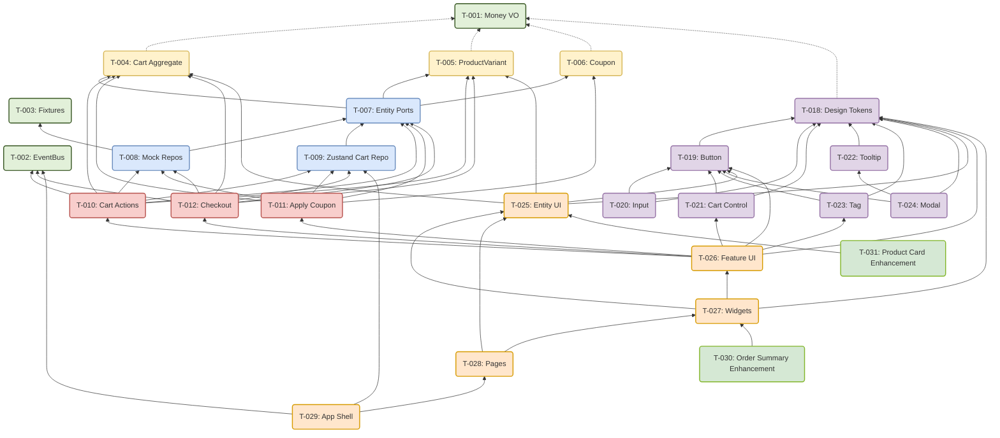

# Implementation Tickets — Shopping Cart (FSD)

> Tickets are ordered by **tier** (dependency order). A ticket can only start after all its `Depends On` items are complete. All tickets within the same tier can be executed **in parallel**.
>
> Architecture: Feature-Sliced Design. See [DDD_CONTEXT.md](./DDD_CONTEXT.md) for domain-to-FSD mapping.

---

## Tier 1 — Shared Foundation

_Independent tasks that form the base of the application._

### T-001: `Money` Value Object

| Field               | Value                 |
| ------------------- | --------------------- |
| **Layer / Segment** | `shared/lib/money.ts` |
| **Complexity**      | 🟢 Small              |
| **Depends On**      | —                     |

**Description**: Implement an immutable Value Object that wraps financial amounts as integers (cents) to avoid floating-point issues. Must support `add`, `subtract`, `multiply`, `equals`, and `format` (locale-aware currency string).

**Files to create:**

- `src/shared/lib/money.ts` — Money class
- `src/shared/lib/money.test.ts` — unit tests
- Update `src/shared/lib/index.ts` — re-export Money

**Acceptance Criteria**:

- [ ] All arithmetic uses integer cents internally
- [ ] `Money.fromPrice(25)` → stores `2500` cents
- [ ] `money.format()` → `"$25.00"`
- [ ] Immutable — all operations return new `Money` instances
- [ ] Unit tests cover arithmetic, formatting, and edge cases (zero, negative guard)

---

### T-002: Async Domain Event Bus

| Field               | Value                     |
| ------------------- | ------------------------- |
| **Layer / Segment** | `shared/lib/event-bus.ts` |
| **Complexity**      | 🟡 Medium                 |
| **Depends On**      | —                         |

**Description**: Implement a typed, async Pub/Sub event bus. Handlers subscribe by event type and are invoked asynchronously when events are published. Must support multiple handlers per event and provide an `unsubscribe` mechanism.

**Files to create:**

- `src/shared/lib/event-bus.ts` — EventBus class
- `src/shared/lib/event-bus.test.ts` — unit tests
- Update `src/shared/lib/index.ts` — re-export EventBus

**Acceptance Criteria**:

- [ ] `eventBus.subscribe<ItemAddedToCart>(handler)` registers a typed handler
- [ ] `eventBus.publish(event)` invokes all matching handlers asynchronously
- [ ] Multiple handlers per event type supported
- [ ] `unsubscribe` returns a teardown function
- [ ] Unit tests cover: subscribe, multi-handler dispatch, unsubscribe, async execution order

---

### T-003: Shared Fixtures (Mock Data)

| Field               | Value                  |
| ------------------- | ---------------------- |
| **Layer / Segment** | `shared/api/fixtures/` |
| **Complexity**      | 🟢 Small               |
| **Depends On**      | —                      |

**Description**: Create typed mock data for products, inventory, coupons. This data will be consumed by entity repositories until a real API is connected.

**Files to create:**

- `src/shared/api/fixtures/products.ts` — product data
- `src/shared/api/fixtures/inventory.ts` — stock levels
- `src/shared/api/fixtures/coupons.ts` — coupon codes
- `src/shared/api/fixtures/index.ts` — re-exports
- Update `src/shared/api/index.ts` — re-export fixtures

**Acceptance Criteria**:

- [ ] Each fixture has a corresponding TypeScript interface
- [ ] Data is importable via `import { inventoryData } from '@/shared/api'`
- [ ] Types match the actual data shape (validated by TS compiler, no `any`)
- [ ] At least 6 products, matching inventory records, 2-3 coupon codes

---

## Tier 2 — Domain Entities

_Core business logic depending only on Tier 1._

### T-004: `Cart` Aggregate + `CartItem` Entity

| Field             | Value           |
| ----------------- | --------------- |
| **Layer / Slice** | `entities/cart` |
| **Complexity**    | 🟡 Medium       |
| **Depends On**    | T-001           |

**Description**: Implement Cart (Aggregate Root) and CartItem (Entity). The Cart manages a collection of CartItems keyed by `skuId`. Enforce invariants: quantity ≥ 1, multiple coupons allowed. Cart has lifecycle states: `Active` → `Checkout_Pending` → `Checked_Out`. Subtotal computed from CartItem prices using Money.

**Files to create:**

- `src/entities/cart/model/cart.ts` — Cart aggregate root
- `src/entities/cart/model/cart-item.ts` — CartItem entity
- `src/entities/cart/model/types.ts` — CartState enum, CartItem type
- `src/entities/cart/model/events.ts` — domain event types (ItemAddedToCart, CartItemQuantityChanged, ItemRemovedFromCart, CartCleared)
- `src/entities/cart/model/cart.test.ts` — unit tests
- `src/entities/cart/index.ts` — public API

**Acceptance Criteria**:

- [ ] `cart.addItem(item)` adds or increments quantity
- [ ] `cart.removeItem(skuId)` removes an item
- [ ] `cart.changeQuantity(skuId, qty)` enforces qty ≥ 1
- [ ] `cart.subtotal` returns a `Money` value
- [ ] State transitions: `initiateCheckout()` → `Checkout_Pending`, `markCheckedOut()` → `Checked_Out`
- [ ] Domain events emitted for each mutation
- [ ] Unit tests for all invariants and state transitions

---

### T-005: `ProductVariant` Aggregate

| Field             | Value              |
| ----------------- | ------------------ |
| **Layer / Slice** | `entities/product` |
| **Complexity**    | 🟡 Medium          |
| **Depends On**    | T-001              |

**Description**: Implement ProductVariant aggregate with stock tracking. Holds `totalOnHand`, `sold`, pricing info, and StockReservations. Available stock = `totalOnHand - sumReserved`. Enforce `totalOnHand ≥ 0`.

**Files to create:**

- `src/entities/product/model/product-variant.ts` — ProductVariant aggregate
- `src/entities/product/model/stock-reservation.ts` — StockReservation VO
- `src/entities/product/model/types.ts` — types
- `src/entities/product/model/events.ts` — StockReserved, StockDepleted
- `src/entities/product/model/product-variant.test.ts` — unit tests
- `src/entities/product/index.ts` — public API

**Acceptance Criteria**:

- [ ] `variant.availableStock` computes correctly
- [ ] `variant.reserve(orderId, qty)` creates a StockReservation
- [ ] `variant.releaseReservation(orderId)` removes it
- [ ] `variant.confirmDepletion(orderId)` reduces `totalOnHand` and removes reservation
- [ ] Domain events: `StockReserved`, `StockDepleted`
- [ ] Unit tests for stock math and reservation lifecycle

---

### T-006: `Coupon` Aggregate

| Field             | Value             |
| ----------------- | ----------------- |
| **Layer / Slice** | `entities/coupon` |
| **Complexity**    | 🟡 Medium         |
| **Depends On**    | T-001             |

**Description**: Implement Coupon aggregate. Supports two discount modes: flat amount or percentage. Calculating discount against a subtotal must never result in negative totals.

**Files to create:**

- `src/entities/coupon/model/coupon.ts` — Coupon aggregate
- `src/entities/coupon/model/types.ts` — types
- `src/entities/coupon/model/events.ts` — CouponValidated, CouponValidationFailed, DiscountCalculated
- `src/entities/coupon/model/coupon.test.ts` — unit tests
- `src/entities/coupon/index.ts` — public API

**Acceptance Criteria**:

- [ ] `coupon.calculateDiscount(subtotal: Money): Money` works for flat and percentage modes
- [ ] Percentage mode: `$100 subtotal × 10% → $10 discount`
- [ ] Flat mode: `$5 off`
- [ ] 100% discount caps at subtotal (total ≥ $0.00)
- [ ] Domain events emitted
- [ ] Unit tests for both modes + edge cases

---

## Tier 3 — Entity Ports & Repositories

_Interfaces and data access depending on entities from Tier 2._

### T-007: Entity Ports (Repository Interfaces)

| Field             | Value                                                  |
| ----------------- | ------------------------------------------------------ |
| **Layer / Slice** | `entities/cart`, `entities/product`, `entities/coupon` |
| **Complexity**    | 🟢 Small                                               |
| **Depends On**    | T-004, T-005, T-006                                    |

**Description**: Define port interfaces for each entity. These are the contracts that repository implementations must fulfill.

**Files to create:**

- `src/entities/cart/model/ports.ts` — `ICartRepository`: `getCart()`, `saveCart(cart)`
- `src/entities/product/model/ports.ts` — `IStockRepository`: `findBySku(skuId)`, `save(variant)`
- `src/entities/coupon/model/ports.ts` — `ICouponRepository`: `findByCode(code)`
- Update each `index.ts` to export port types

**Acceptance Criteria**:

- [ ] All return types are domain types (no infrastructure leaks)
- [ ] Ports use domain types, not raw JSON shapes
- [ ] Exported from slice public API

---

### T-008: Mock Repositories (Driven Adapters)

| Field             | Value                                           |
| ----------------- | ----------------------------------------------- |
| **Layer / Slice** | `entities/product/api/`, `entities/coupon/api/` |
| **Complexity**    | 🟢 Small                                        |
| **Depends On**    | T-003, T-007                                    |

**Description**: Implement MockInventoryRepository and MockCouponRepository. Load data from shared/api fixtures. These implement the port interfaces from T-007.

**Files to create:**

- `src/entities/product/api/mock-inventory-repository.ts` — implements IStockRepository
- `src/entities/coupon/api/mock-coupon-repository.ts` — implements ICouponRepository
- Update each slice's `index.ts`

**Acceptance Criteria**:

- [ ] Repositories load data from shared fixtures at initialization
- [ ] `MockInventoryRepository.findBySku(skuId)` returns a `ProductVariant`
- [ ] `MockCouponRepository.findByCode(code)` returns a `Coupon` or `null`
- [ ] Behind port interface — swapping to API-backed repo later requires zero domain changes

---

### T-009: Zustand Cart Repository

| Field             | Value                |
| ----------------- | -------------------- |
| **Layer / Slice** | `entities/cart/api/` |
| **Complexity**    | 🟡 Medium            |
| **Depends On**    | T-007                |

**Description**: Implement ZustandCartRepository implementing ICartRepository. Cart state lives in a Zustand store, exposed through the port interface.

**Files to create:**

- `src/entities/cart/api/zustand-cart-repository.ts` — implements ICartRepository
- `src/entities/cart/api/cart-store.ts` — Zustand store definition
- Update `src/entities/cart/index.ts`

**Acceptance Criteria**:

- [ ] `getCart()` returns reactive Cart state
- [ ] `saveCart(cart)` updates Zustand store
- [ ] Integration test verifying round-trip (save → get → verify)

---

## Tier 4 — Features (Use Cases)

_User interactions orchestrating entities._

### T-010: Cart Actions Feature

| Field             | Value                                    |
| ----------------- | ---------------------------------------- |
| **Layer / Slice** | `features/cart-actions`                  |
| **Complexity**    | 🔴 Large                                 |
| **Depends On**    | T-004, T-005, T-007, T-008, T-009, T-002 |

**Description**: Implement AddToCart, RemoveFromCart, ChangeCartItemQuantity use cases. Each orchestrates Cart entity and checks stock via Product entity. Publishes domain events via EventBus.

**Files to create:**

- `src/features/cart-actions/model/add-to-cart.ts`
- `src/features/cart-actions/model/remove-from-cart.ts`
- `src/features/cart-actions/model/change-quantity.ts`
- `src/features/cart-actions/model/index.ts` — re-exports
- `src/features/cart-actions/model/add-to-cart.test.ts` — unit tests (mocked repos)
- `src/features/cart-actions/index.ts` — public API

**Imports (FSD-compliant):**

- `@/entities/cart` — Cart aggregate, ICartRepository
- `@/entities/product` — ProductVariant, IStockRepository
- `@/shared/lib` — EventBus, Money

**Acceptance Criteria**:

- [ ] `AddToCart` checks stock via IStockRepository before adding
- [ ] `ChangeQuantity` checks stock before updating
- [ ] All use cases publish domain events via EventBus
- [ ] Unit tests with mocked repositories for each use case (happy + error paths)

---

### T-011: Apply Coupon Feature

| Field             | Value                             |
| ----------------- | --------------------------------- |
| **Layer / Slice** | `features/apply-coupon`           |
| **Complexity**    | 🟡 Medium                         |
| **Depends On**    | T-004, T-006, T-007, T-008, T-009 |

**Description**: Implement ApplyCoupon, RemoveCoupon, and CalculateDiscount use cases. Validates coupon code via Coupon entity, applies discount to cart.

**Files to create:**

- `src/features/apply-coupon/model/apply-coupon.ts`
- `src/features/apply-coupon/model/remove-coupon.ts`
- `src/features/apply-coupon/model/calculate-discount.ts`
- `src/features/apply-coupon/model/apply-coupon.test.ts`
- `src/features/apply-coupon/index.ts`

**Imports (FSD-compliant):**

- `@/entities/cart` — Cart aggregate, ICartRepository
- `@/entities/coupon` — Coupon, ICouponRepository
- `@/shared/lib` — EventBus, Money

**Acceptance Criteria**:

- [ ] `ApplyCoupon` validates code via ICouponRepository
- [ ] Empty code → "Please enter a valid code" error
- [ ] Invalid code → "Sorry, but this coupon doesn't exist" error
- [ ] Valid code → discount applied, events emitted
- [ ] `RemoveCoupon` removes and recalculates
- [ ] Unit tests with mock repos

---

### T-012: Checkout Feature

| Field             | Value                                    |
| ----------------- | ---------------------------------------- |
| **Layer / Slice** | `features/checkout`                      |
| **Complexity**    | 🔴 Large                                 |
| **Depends On**    | T-004, T-005, T-007, T-008, T-009, T-002 |

**Description**: Implement InitiateCheckout use case. Validates all items' stock, transitions cart to Checkout_Pending, emits CheckoutInitiated. Inventory subscribes (via EventBus) to reserve stock.

**Files to create:**

- `src/features/checkout/model/initiate-checkout.ts`
- `src/features/checkout/model/initiate-checkout.test.ts`
- `src/features/checkout/index.ts`

**Imports (FSD-compliant):**

- `@/entities/cart` — Cart aggregate, ICartRepository
- `@/entities/product` — ProductVariant, IStockRepository
- `@/shared/lib` — EventBus

**Acceptance Criteria**:

- [ ] Validates all cart items' stock availability
- [ ] If stock changed → returns conflict info (items + updated quantities)
- [ ] Emits `CheckoutInitiated` event
- [ ] Cart transitions to `Checkout_Pending` state
- [ ] Stock reservation triggered via EventBus subscription
- [ ] Integration test covering the full event chain

---

## Tier 5 — Design System (Base Components)

_Atomic UI components — no dependencies on domain logic. Everything in Tier 6+ depends on these._

### T-018: Design Tokens

| Field             | Value               |
| ----------------- | ------------------- |
| **Layer / Slice** | `shared/ui/tokens/` |
| **Complexity**    | 🟢 Small            |
| **Depends On**    | —                   |

**Description**: Define the foundational design tokens from the Penpot design system — colors (primary, secondary, accent, surface, background, text, border, error, success), typography (font families, sizes, weights, line-heights), spacing scale (4px base), and border radius. Tokens are CSS custom properties exported as a theme object.

**Files to create:**

- `src/shared/ui/tokens/colors.ts` — color palette
- `src/shared/ui/tokens/typography.ts` — font sizes, weights, families
- `src/shared/ui/tokens/spacing.ts` — spacing scale
- `src/shared/ui/tokens/index.ts` — re-exports + combined theme object
- `src/shared/ui/tokens/tokens.css` — CSS custom properties for runtime theming

**Acceptance Criteria**:

- [ ] All color tokens defined as HSL values for flexibility
- [ ] Typography scale uses rem units
- [ ] Spacing scale follows 4px base (4, 8, 12, 16, 24, 32, 48, 64)
- [ ] Border radius tokens: sm=4px, md=8px, lg=12px, xl=16px
- [ ] Exported as TypeScript constants + CSS variables
- [ ] Storybook stories for color swatches and typography specimens

---

### T-019: Button Component

| Field             | Value               |
| ----------------- | ------------------- |
| **Layer / Slice** | `shared/ui/button/` |
| **Complexity**    | 🟡 Medium           |
| **Depends On**    | T-018               |

**Description**: Build the `Button` component using design tokens. Support variants: `primary`, `secondary`, `ghost`, `danger`. Support sizes: `sm`, `md`, `lg`. Support states: default, hover, active, disabled, loading (spinner).

**Files to create:**

- `src/shared/ui/button/button.tsx`
- `src/shared/ui/button/button.stories.tsx`
- `src/shared/ui/button/index.ts`
- Update `src/shared/ui/index.ts`

**Acceptance Criteria**:

- [ ] All 4 variants + 3 sizes implemented with tokens
- [ ] Loading state shows spinner and disables interaction
- [ ] Icon support (left/right slot)
- [ ] Full keyboard accessibility (focus states, Enter/Space activation)
- [ ] Storybook stories covering all variant/size/state combinations

---

### T-020: Input Field

| Field             | Value              |
| ----------------- | ------------------ |
| **Layer / Slice** | `shared/ui/input/` |
| **Complexity**    | 🟡 Medium          |
| **Depends On**    | T-018, T-019       |

**Description**: Build the `Input` component. Support types: text, email, password. States: default, focus, error, disabled. Error message slot below input. Label slot above.

**Files to create:**

- `src/shared/ui/input/input.tsx`
- `src/shared/ui/input/input.stories.tsx`
- `src/shared/ui/input/index.ts`
- Update `src/shared/ui/index.ts`

**Acceptance Criteria**:

- [ ] Controlled component with `value` and `onChange`
- [ ] `error` prop triggers red border + error message display
- [ ] `label` prop renders accessible label above
- [ ] Focus state uses design token border color
- [ ] Storybook stories for all states

---

### T-021: Cart Control

| Field             | Value                     |
| ----------------- | ------------------------- |
| **Layer / Slice** | `shared/ui/cart-control/` |
| **Complexity**    | 🟡 Medium                 |
| **Depends On**    | T-018, T-019              |

**Description**: Build a reusable `CartControl` molecule: a quantity selector with "−" / quantity / "+" buttons and a remove button. Combines Button components.

**Files to create:**

- `src/shared/ui/cart-control/cart-control.tsx`
- `src/shared/ui/cart-control/cart-control.stories.tsx`
- `src/shared/ui/cart-control/index.ts`
- Update `src/shared/ui/index.ts`

**Acceptance Criteria**:

- [ ] "−" button disabled when quantity = min (1)
- [ ] "+" button disabled when quantity = max
- [ ] Remove button with confirmation state
- [ ] Emits events: `onIncrement`, `onDecrement`, `onRemove`
- [ ] Storybook stories for min/max/disabled states

---

### T-022: Tooltip

| Field             | Value                |
| ----------------- | -------------------- |
| **Layer / Slice** | `shared/ui/tooltip/` |
| **Complexity**    | 🟢 Small             |
| **Depends On**    | T-018                |

**Description**: Build the `Tooltip` component. Position: top, bottom, left, right. Trigger: hover (desktop) / long-press (mobile). Uses design tokens for background, text, shadow.

**Files to create:**

- `src/shared/ui/tooltip/tooltip.tsx`
- `src/shared/ui/tooltip/tooltip.stories.tsx`
- `src/shared/ui/tooltip/index.ts`
- Update `src/shared/ui/index.ts`

**Acceptance Criteria**:

- [ ] All 4 positions implemented
- [ ] Accessible: uses `role="tooltip"`, `aria-describedby`
- [ ] Uses design tokens for colors and shadow
- [ ] Storybook stories for all positions

---

### T-023: Tag

| Field             | Value            |
| ----------------- | ---------------- |
| **Layer / Slice** | `shared/ui/tag/` |
| **Complexity**    | 🟢 Small         |
| **Depends On**    | T-018, T-019     |

**Description**: Build the `Tag` component. Variants: `success`, `error`, `warning`, `info`, `neutral`. Optional dismiss "×" button.

**Files to create:**

- `src/shared/ui/tag/tag.tsx`
- `src/shared/ui/tag/tag.stories.tsx`
- `src/shared/ui/tag/index.ts`
- Update `src/shared/ui/index.ts`

**Acceptance Criteria**:

- [ ] All 5 variants with semantic colors from design tokens
- [ ] Optional dismiss button with onClick handler
- [ ] Storybook stories for all variants + dismiss state

---

### T-024: Modal

| Field             | Value               |
| ----------------- | ------------------- |
| **Layer / Slice** | `shared/ui/modal/`  |
| **Complexity**    | 🟡 Medium           |
| **Depends On**    | T-018, T-019, T-022 |

**Description**: Build the `Modal` component. Features: backdrop click to close, "×" close button, focus trap, ESC key to close. Uses Tooltip for any helper content.

**Files to create:**

- `src/shared/ui/modal/modal.tsx`
- `src/shared/ui/modal/modal.stories.tsx`
- `src/shared/ui/modal/index.ts`
- Update `src/shared/ui/index.ts`

**Acceptance Criteria**:

- [ ] Backdrop click closes modal
- [ ] "×" button in top-right corner
- [ ] Focus trapped inside modal when open
- [ ] ESC key closes modal
- [ ] Accessible: `role="dialog"`, `aria-modal="true"`, `aria-labelledby`
- [ ] Storybook stories for open/close states

---

## Tier 5 (continued) — Entity UI

### T-025: Entity UI — CartRow, ProductCard, EmptyState

| Field             | Value                                       |
| ----------------- | ------------------------------------------- |
| **Layer / Slice** | `entities/cart/ui/`, `entities/product/ui/` |
| **Complexity**    | 🟡 Medium                                   |
| **Depends On**    | T-004, T-005, T-018, T-019                  |

**Description**: Build pure presentation components for entities. These display data but don't orchestrate business logic. Use design tokens and base components from T-018–T-024.

**Files to create:**

- `src/entities/cart/ui/CartRow.tsx` — variant image, name, pricing, quantity display
- `src/entities/cart/ui/CartRow.stories.tsx`
- `src/entities/cart/ui/EmptyState.tsx` — empty cart illustration/message
- `src/entities/cart/ui/EmptyState.stories.tsx`
- `src/entities/product/ui/ProductCard.tsx` — image, name, price
- `src/entities/product/ui/ProductCard.stories.tsx`
- Update each slice's `index.ts`

**Acceptance Criteria**:

- [ ] CartRow: shows image, name, pricing (strikethrough list price if discounted), quantity
- [ ] EmptyState: rendered when cart is empty
- [ ] ProductCard: shows product image, name, price
- [ ] All components have Storybook stories (story-first convention)
- [ ] Components receive data via props only — no direct store access
- [ ] Responsive: works on mobile and desktop

---

### T-026: Feature UI — QuantitySelector, CouponInput, CheckoutButton

| Field             | Value                                                                             |
| ----------------- | --------------------------------------------------------------------------------- |
| **Layer / Slice** | `features/cart-actions/ui/`, `features/apply-coupon/ui/`, `features/checkout/ui/` |
| **Complexity**    | 🔴 Large                                                                          |
| **Depends On**    | T-010, T-011, T-012, T-018, T-019, T-021, T-023                                   |

**Description**: Build interactive UI components that trigger feature use cases. Use base components from design system.

**Files to create:**

- `src/features/cart-actions/ui/QuantitySelector.tsx` — "−" / "+" buttons, calls ChangeQuantity
- `src/features/cart-actions/ui/QuantitySelector.stories.tsx`
- `src/features/cart-actions/ui/RemoveButton.tsx` — remove link with confirmation
- `src/features/apply-coupon/ui/CouponInput.tsx` — button → input transition, Apply, validation states
- `src/features/apply-coupon/ui/CouponInput.stories.tsx`
- `src/features/checkout/ui/CheckoutButton.tsx` — triggers InitiateCheckout
- `src/features/checkout/ui/StockConflictModal.tsx` — shows if stock changed during checkout
- Update each slice's `index.ts`

**Acceptance Criteria**:

- [ ] QuantitySelector: "−" disabled at qty=1, "+" disabled at max stock
- [ ] RemoveButton: confirmation before removal
- [ ] CouponInput states: normal, filled, focus, disabled, error, success tag
- [ ] Empty submit → error, invalid code → error, valid → success tag
- [ ] "x" on applied coupon tag removes coupon
- [ ] CheckoutButton triggers use case, handles stock conflicts
- [ ] All components have stories

---

### T-027: Widgets — CartList, OrderSummary

| Field             | Value                                        |
| ----------------- | -------------------------------------------- |
| **Layer / Slice** | `widgets/cart-list`, `widgets/order-summary` |
| **Complexity**    | 🟡 Medium                                    |
| **Depends On**    | T-025, T-026, T-018                          |

**Description**: Compose entity UI + feature UI into self-contained widget blocks.

**Files to create:**

- `src/widgets/cart-list/ui/CartList.tsx` — maps cart items to CartRow + QuantitySelector + RemoveButton
- `src/widgets/cart-list/index.ts`
- `src/widgets/order-summary/ui/OrderSummary.tsx` — subtotal, discounts, shipping, total + CouponInput
- `src/widgets/order-summary/index.ts`

**Imports (FSD-compliant):**

- `widgets/cart-list` → `entities/cart`, `features/cart-actions`
- `widgets/order-summary` → `entities/cart`, `features/apply-coupon`, `features/checkout`

**Acceptance Criteria**:

- [ ] CartList: renders list sorted by `created_at` (latest first), shows EmptyState when empty
- [ ] OrderSummary: subtotal, shipping (FREE), applied discounts, total — updates in real time
- [ ] Responsive layout: two-column on desktop, stacked on mobile

---

## Tier 6 — Pages & App Shell

_Top-level composition and wiring._

### T-028: Pages — Cart, Home

| Field             | Value                      |
| ----------------- | -------------------------- |
| **Layer / Slice** | `pages/cart`, `pages/home` |
| **Complexity**    | 🟡 Medium                  |
| **Depends On**    | T-027, T-025               |

**Description**: Create page-level compositions. Pages compose widgets and handle layout.

**Files to create:**

- `src/pages/cart/ui/CartPage.tsx` — CartList + OrderSummary side-by-side
- `src/pages/cart/index.ts`
- `src/pages/home/ui/HomePage.tsx` — product grid with AddToCartButton on each ProductCard
- `src/pages/home/index.ts`

**Acceptance Criteria**:

- [ ] CartPage: two-column layout (cart items left, summary right), stacked on mobile
- [ ] HomePage: responsive product grid
- [ ] Pages import only from widgets, features, entities, shared — never from other pages

---

### T-029: App Shell — Routing & Providers

| Field             | Value               |
| ----------------- | ------------------- |
| **Layer / Slice** | `app/`              |
| **Complexity**    | 🟡 Medium           |
| **Depends On**    | T-028, T-002, T-009 |

**Description**: Wire everything together. App-level providers (Zustand, EventBus subscriptions), routing, global layout with header/navigation.

**Files to create:**

- `src/app/providers/` — EventBus provider, repository wiring
- `src/app/routing/` — route config (react-router or manual)
- `src/app/ui/Layout.tsx` — header with nav + CartIcon + main content area
- Update `src/app/index.ts`
- Update `src/App.tsx`

**Acceptance Criteria**:

- [ ] Navigation between Home and Cart pages
- [ ] CartIcon in header shows item count badge
- [ ] EventBus subscriptions wired (e.g., CheckoutInitiated → ReserveStock)
- [ ] All repository implementations injected via providers
- [ ] All lint/build checks pass

---

## Summary Matrix

| Tier                            | Tickets                                         | Effort         |
| ------------------------------- | ----------------------------------------------- | -------------- |
| **Tier 1 — Shared Foundation**  | T-001, T-002, T-003                             | 🟢🟡🟢         |
| **Tier 2 — Domain Entities**    | T-004, T-005, T-006                             | 🟡🟡🟡         |
| **Tier 3 — Ports & Repos**      | T-007, T-008, T-009                             | 🟢🟢🟡         |
| **Tier 4 — Features**           | T-010, T-011, T-012                             | 🔴🟡🔴         |
| **Tier 5 — Design System**      | T-018, T-019, T-020, T-021, T-022, T-023, T-024 | 🟢🟡🟡🟡🟢🟢🟡 |
| **Tier 5 (cont.) — Entity UI**  | T-025                                           | 🟡             |
| **Tier 5 (cont.) — Feature UI** | T-026                                           | 🔴             |
| **Tier 5 (cont.) — Widgets**    | T-027                                           | 🟡             |
| **Tier 6 — Pages & App**        | T-028, T-029                                    | 🟡🟡           |
| **Tier 7 — Enhancements**       | T-030, T-031                                    | 🟢🟢           |
| **Total**                       | **29 tickets**                                  |                |

### Dependency Graph

