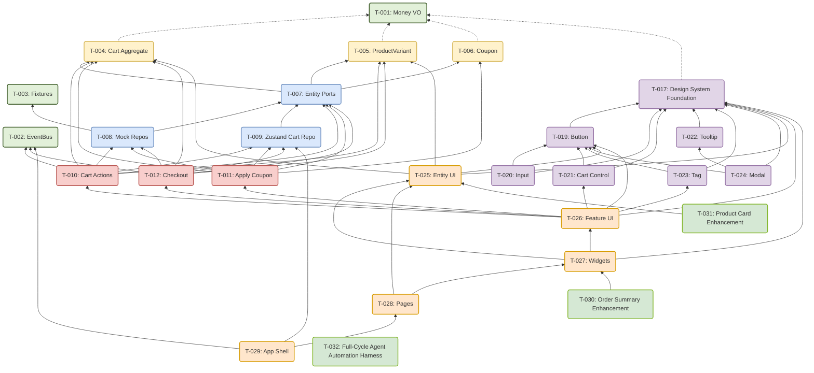

# Implementation Tickets — Shopping Cart (FSD)

> Tickets are ordered by **tier** (dependency order). A ticket can only start after all its `Depends On` items are complete. All tickets within the same tier can be executed **in parallel**.
>
> Architecture: Feature-Sliced Design. See [DDD_CONTEXT.md](./DDD_CONTEXT.md) for domain-to-FSD mapping.

---

## Tier 1 — Shared Foundation

_Independent tasks that form the base of the application._

### T-001: `Money` Value Object

| Field               | Value                 |
| ------------------- | --------------------- |
| **Layer / Segment** | `shared/lib/money.ts` |
| **Complexity**      | 🟢 Small              |
| **Depends On**      | —                     |

**Description**: Implement an immutable Value Object that wraps financial amounts as integers (cents) to avoid floating-point issues. Must support `add`, `subtract`, `multiply`, `equals`, and `format` (locale-aware currency string).

**Files to create:**

- `src/shared/lib/money.ts` — Money class
- `src/shared/lib/money.test.ts` — unit tests
- Update `src/shared/lib/index.ts` — re-export Money

**Acceptance Criteria**:

- [ ] All arithmetic uses integer cents internally
- [ ] `Money.fromPrice(25)` → stores `2500` cents
- [ ] `money.format()` → `"$25.00"`
- [ ] Immutable — all operations return new `Money` instances
- [ ] Unit tests cover arithmetic, formatting, and edge cases (zero, negative guard)

---

### T-002: Async Domain Event Bus

| Field               | Value                     |
| ------------------- | ------------------------- |
| **Layer / Segment** | `shared/lib/event-bus.ts` |
| **Complexity**      | 🟡 Medium                 |
| **Depends On**      | —                         |

**Description**: Implement a typed, async Pub/Sub event bus. Handlers subscribe by event type and are invoked asynchronously when events are published. Must support multiple handlers per event and provide an `unsubscribe` mechanism.

**Files to create:**

- `src/shared/lib/event-bus.ts` — EventBus class
- `src/shared/lib/event-bus.test.ts` — unit tests
- Update `src/shared/lib/index.ts` — re-export EventBus

**Acceptance Criteria**:

- [ ] `eventBus.subscribe<ItemAddedToCart>(handler)` registers a typed handler
- [ ] `eventBus.publish(event)` invokes all matching handlers asynchronously
- [ ] Multiple handlers per event type supported
- [ ] `unsubscribe` returns a teardown function
- [ ] Unit tests cover: subscribe, multi-handler dispatch, unsubscribe, async execution order

---

### T-003: Shared Fixtures (Mock Data)

| Field               | Value                  |
| ------------------- | ---------------------- |
| **Layer / Segment** | `shared/api/fixtures/` |
| **Complexity**      | 🟢 Small               |
| **Depends On**      | —                      |

**Description**: Create typed mock data for products, inventory, coupons. This data will be consumed by entity repositories until a real API is connected.

**Files to create:**

- `src/shared/api/fixtures/products.ts` — product data
- `src/shared/api/fixtures/inventory.ts` — stock levels
- `src/shared/api/fixtures/coupons.ts` — coupon codes
- `src/shared/api/fixtures/index.ts` — re-exports
- Update `src/shared/api/index.ts` — re-export fixtures

**Acceptance Criteria**:

- [ ] Each fixture has a corresponding TypeScript interface
- [ ] Data is importable via `import { inventoryData } from '@/shared/api'`
- [ ] Types match the actual data shape (validated by TS compiler, no `any`)
- [ ] At least 6 products, matching inventory records, 2-3 coupon codes

---

## Tier 2 — Domain Entities

_Core business logic depending only on Tier 1._

### T-004: `Cart` Aggregate + `CartItem` Entity

| Field             | Value           |
| ----------------- | --------------- |
| **Layer / Slice** | `entities/cart` |
| **Complexity**    | 🟡 Medium       |
| **Depends On**    | T-001           |

**Description**: Implement Cart (Aggregate Root) and CartItem (Entity). The Cart manages a collection of CartItems keyed by `skuId`. Enforce invariants: quantity ≥ 1, multiple coupons allowed. Cart has lifecycle states: `Active` → `Checkout_Pending` → `Checked_Out`. Subtotal computed from CartItem prices using Money.

**Files to create:**

- `src/entities/cart/model/cart.ts` — Cart aggregate root
- `src/entities/cart/model/cart-item.ts` — CartItem entity
- `src/entities/cart/model/types.ts` — CartState enum, CartItem type
- `src/entities/cart/model/events.ts` — domain event types (ItemAddedToCart, CartItemQuantityChanged, ItemRemovedFromCart, CartCleared)
- `src/entities/cart/model/cart.test.ts` — unit tests
- `src/entities/cart/index.ts` — public API

**Acceptance Criteria**:

- [ ] `cart.addItem(item)` adds or increments quantity
- [ ] `cart.removeItem(skuId)` removes an item
- [ ] `cart.changeQuantity(skuId, qty)` enforces qty ≥ 1
- [ ] `cart.subtotal` returns a `Money` value
- [ ] State transitions: `initiateCheckout()` → `Checkout_Pending`, `markCheckedOut()` → `Checked_Out`
- [ ] Domain events emitted for each mutation
- [ ] Unit tests for all invariants and state transitions

---

### T-005: `ProductVariant` Aggregate

| Field             | Value              |
| ----------------- | ------------------ |
| **Layer / Slice** | `entities/product` |
| **Complexity**    | 🟡 Medium          |
| **Depends On**    | T-001              |

**Description**: Implement ProductVariant aggregate with stock tracking. Holds `totalOnHand`, `sold`, pricing info, and StockReservations. Available stock = `totalOnHand - sumReserved`. Enforce `totalOnHand ≥ 0`.

**Files to create:**

- `src/entities/product/model/product-variant.ts` — ProductVariant aggregate
- `src/entities/product/model/stock-reservation.ts` — StockReservation VO
- `src/entities/product/model/types.ts` — types
- `src/entities/product/model/events.ts` — StockReserved, StockDepleted
- `src/entities/product/model/product-variant.test.ts` — unit tests
- `src/entities/product/index.ts` — public API

**Acceptance Criteria**:

- [ ] `variant.availableStock` computes correctly
- [ ] `variant.reserve(orderId, qty)` creates a StockReservation
- [ ] `variant.releaseReservation(orderId)` removes it
- [ ] `variant.confirmDepletion(orderId)` reduces `totalOnHand` and removes reservation
- [ ] Domain events: `StockReserved`, `StockDepleted`
- [ ] Unit tests for stock math and reservation lifecycle

---

### T-006: `Coupon` Aggregate

| Field             | Value             |
| ----------------- | ----------------- |
| **Layer / Slice** | `entities/coupon` |
| **Complexity**    | 🟡 Medium         |
| **Depends On**    | T-001             |

**Description**: Implement Coupon aggregate. Supports two discount modes: flat amount or percentage. Calculating discount against a subtotal must never result in negative totals.

**Files to create:**

- `src/entities/coupon/model/coupon.ts` — Coupon aggregate
- `src/entities/coupon/model/types.ts` — types
- `src/entities/coupon/model/events.ts` — CouponValidated, CouponValidationFailed, DiscountCalculated
- `src/entities/coupon/model/coupon.test.ts` — unit tests
- `src/entities/coupon/index.ts` — public API

**Acceptance Criteria**:

- [ ] `coupon.calculateDiscount(subtotal: Money): Money` works for flat and percentage modes
- [ ] Percentage mode: `$100 subtotal × 10% → $10 discount`
- [ ] Flat mode: `$5 off`
- [ ] 100% discount caps at subtotal (total ≥ $0.00)
- [ ] Domain events emitted
- [ ] Unit tests for both modes + edge cases

---

## Tier 3 — Entity Ports & Repositories

_Interfaces and data access depending on entities from Tier 2._

### T-007: Entity Ports (Repository Interfaces)

| Field             | Value                                                  |
| ----------------- | ------------------------------------------------------ |
| **Layer / Slice** | `entities/cart`, `entities/product`, `entities/coupon` |
| **Complexity**    | 🟢 Small                                               |
| **Depends On**    | T-004, T-005, T-006                                    |

**Description**: Define port interfaces for each entity. These are the contracts that repository implementations must fulfill.

**Files to create:**

- `src/entities/cart/model/ports.ts` — `ICartRepository`: `getCart()`, `saveCart(cart)`
- `src/entities/product/model/ports.ts` — `IStockRepository`: `findBySku(skuId)`, `save(variant)`
- `src/entities/coupon/model/ports.ts` — `ICouponRepository`: `findByCode(code)`
- Update each `index.ts` to export port types

**Acceptance Criteria**:

- [ ] All return types are domain types (no infrastructure leaks)
- [ ] Ports use domain types, not raw JSON shapes
- [ ] Exported from slice public API

---

### T-008: Mock Repositories (Driven Adapters)

| Field             | Value                                           |
| ----------------- | ----------------------------------------------- |
| **Layer / Slice** | `entities/product/api/`, `entities/coupon/api/` |
| **Complexity**    | 🟢 Small                                        |
| **Depends On**    | T-003, T-007                                    |

**Description**: Implement MockInventoryRepository and MockCouponRepository. Load data from shared/api fixtures. These implement the port interfaces from T-007.

**Files to create:**

- `src/entities/product/api/mock-inventory-repository.ts` — implements IStockRepository
- `src/entities/coupon/api/mock-coupon-repository.ts` — implements ICouponRepository
- Update each slice's `index.ts`

**Acceptance Criteria**:

- [ ] Repositories load data from shared fixtures at initialization
- [ ] `MockInventoryRepository.findBySku(skuId)` returns a `ProductVariant`
- [ ] `MockCouponRepository.findByCode(code)` returns a `Coupon` or `null`
- [ ] Behind port interface — swapping to API-backed repo later requires zero domain changes

---

### T-009: Zustand Cart Repository

| Field             | Value                |
| ----------------- | -------------------- |
| **Layer / Slice** | `entities/cart/api/` |
| **Complexity**    | 🟡 Medium            |
| **Depends On**    | T-007                |

**Description**: Implement ZustandCartRepository implementing ICartRepository. Cart state lives in a Zustand store, exposed through the port interface.

**Files to create:**

- `src/entities/cart/api/zustand-cart-repository.ts` — implements ICartRepository
- `src/entities/cart/api/cart-store.ts` — Zustand store definition
- Update `src/entities/cart/index.ts`

**Acceptance Criteria**:

- [ ] `getCart()` returns reactive Cart state
- [ ] `saveCart(cart)` updates Zustand store
- [ ] Integration test verifying round-trip (save → get → verify)

---

## Tier 4 — Features (Use Cases)

_User interactions orchestrating entities._

### T-010: Cart Actions Feature

| Field             | Value                                    |
| ----------------- | ---------------------------------------- |
| **Layer / Slice** | `features/cart-actions`                  |
| **Complexity**    | 🔴 Large                                 |
| **Depends On**    | T-004, T-005, T-007, T-008, T-009, T-002 |

**Description**: Implement AddToCart, RemoveFromCart, ChangeCartItemQuantity use cases. Each orchestrates Cart entity and checks stock via Product entity. Publishes domain events via EventBus.

**Files to create:**

- `src/features/cart-actions/model/add-to-cart.ts`
- `src/features/cart-actions/model/remove-from-cart.ts`
- `src/features/cart-actions/model/change-quantity.ts`
- `src/features/cart-actions/model/index.ts` — re-exports
- `src/features/cart-actions/model/add-to-cart.test.ts` — unit tests (mocked repos)
- `src/features/cart-actions/index.ts` — public API

**Imports (FSD-compliant):**

- `@/entities/cart` — Cart aggregate, ICartRepository
- `@/entities/product` — ProductVariant, IStockRepository
- `@/shared/lib` — EventBus, Money

**Acceptance Criteria**:

- [ ] `AddToCart` checks stock via IStockRepository before adding
- [ ] `ChangeQuantity` checks stock before updating
- [ ] All use cases publish domain events via EventBus
- [ ] Unit tests with mocked repositories for each use case (happy + error paths)

---

### T-011: Apply Coupon Feature

| Field             | Value                             |
| ----------------- | --------------------------------- |
| **Layer / Slice** | `features/apply-coupon`           |
| **Complexity**    | 🟡 Medium                         |
| **Depends On**    | T-004, T-006, T-007, T-008, T-009 |

**Description**: Implement ApplyCoupon, RemoveCoupon, and CalculateDiscount use cases. Validates coupon code via Coupon entity, applies discount to cart.

**Files to create:**

- `src/features/apply-coupon/model/apply-coupon.ts`
- `src/features/apply-coupon/model/remove-coupon.ts`
- `src/features/apply-coupon/model/calculate-discount.ts`
- `src/features/apply-coupon/model/apply-coupon.test.ts`
- `src/features/apply-coupon/index.ts`

**Imports (FSD-compliant):**

- `@/entities/cart` — Cart aggregate, ICartRepository
- `@/entities/coupon` — Coupon, ICouponRepository
- `@/shared/lib` — EventBus, Money

**Acceptance Criteria**:

- [ ] `ApplyCoupon` validates code via ICouponRepository
- [ ] Empty code → "Please enter a valid code" error
- [ ] Invalid code → "Sorry, but this coupon doesn't exist" error
- [ ] Valid code → discount applied, events emitted
- [ ] `RemoveCoupon` removes and recalculates
- [ ] Unit tests with mock repos

---

### T-012: Checkout Feature

| Field             | Value                                    |
| ----------------- | ---------------------------------------- |
| **Layer / Slice** | `features/checkout`                      |
| **Complexity**    | 🔴 Large                                 |
| **Depends On**    | T-004, T-005, T-007, T-008, T-009, T-002 |

**Description**: Implement InitiateCheckout use case. Validates all items' stock, transitions cart to Checkout_Pending, emits CheckoutInitiated. Inventory subscribes (via EventBus) to reserve stock.

**Files to create:**

- `src/features/checkout/model/initiate-checkout.ts`
- `src/features/checkout/model/initiate-checkout.test.ts`
- `src/features/checkout/index.ts`

**Imports (FSD-compliant):**

- `@/entities/cart` — Cart aggregate, ICartRepository
- `@/entities/product` — ProductVariant, IStockRepository
- `@/shared/lib` — EventBus

**Acceptance Criteria**:

- [ ] Validates all cart items' stock availability
- [ ] If stock changed → returns conflict info (items + updated quantities)
- [ ] Emits `CheckoutInitiated` event
- [ ] Cart transitions to `Checkout_Pending` state
- [ ] Stock reservation triggered via EventBus subscription
- [ ] Integration test covering the full event chain

---

## Tier 5 — Design System (Base Components)

_Atomic UI components — no dependencies on domain logic. Everything in Tier 6+ depends on these._

### T-017: Design System Foundation — Token Architecture & Style Guide

| Field             | Value               |
| ----------------- | ------------------- |
| **Layer / Slice** | `shared/ui/tokens/` |
| **Complexity**    | 🔴 Large            |
| **Depends On**    | —                   |

**Description**: Audit current Penpot design file and existing `theme.css`, then define a complete, extractable design token system. This is a prerequisite for all UI component work. The output must be a single source of truth that lives in code and can be mirrored in Penpot's Design Tokens panel.

**Scope:**

1. **Token Taxonomy**: Define naming convention (primitive vs semantic vs component tokens)
2. **Color System**: Convert all Penpot colors to HSL; define primitive palette (brand, neutral, error, success, warning) + semantic mappings (background, foreground, surface, border, primary, secondary, muted, accent, destructive)
3. **Typography Scale**: Font family (Noto Sans), sizes (xs through 5xl), weights (400–700), line-heights, letter-spacing — all in rem units
4. **Spacing Scale**: 4px-base scale (4, 8, 12, 16, 20, 24, 32, 40, 48, 64, 80, 96, 128)
5. **Border Radius**: sm=4px, md=8px, lg=12px, xl=16px, full=9999px
6. **Shadows / Elevation**: subtle, medium, large shadow tokens
7. **Breakpoints**: sm, md, lg, xl
8. **Z-Index Scale**: dropdown, sticky, modal, tooltip, toast
9. **Documentation**: README in `shared/ui/tokens/` explaining token layers and usage rules

**Files to create / update:**

- `src/shared/ui/tokens/colors.ts` — primitive + semantic color maps (HSL values)
- `src/shared/ui/tokens/typography.ts` — font sizes, weights, families, line-heights
- `src/shared/ui/tokens/spacing.ts` — spacing scale
- `src/shared/ui/tokens/radius.ts` — border radius tokens
- `src/shared/ui/tokens/shadows.ts` — shadow/elevation tokens
- `src/shared/ui/tokens/breakpoints.ts` — responsive breakpoints
- `src/shared/ui/tokens/z-index.ts` — z-index scale
- `src/shared/ui/tokens/index.ts` — combined theme object
- `src/shared/ui/tokens/README.md` — token usage documentation
- `src/shared/ui/tokens/theme.css` — CSS custom properties (replace existing)
- `src/shared/ui/tokens/tokens.stories.tsx` — Storybook stories for all token categories

**Acceptance Criteria:**

- [ ] All color tokens are HSL strings (e.g., `hsl(220 80% 50%)`)
- [ ] No raw hex values in semantic tokens (primitives may use hex as source, exported as HSL)
- [ ] Typography uses rem units exclusively
- [ ] Spacing follows 4px grid with no gaps in the scale
- [ ] All tokens exported as TypeScript constants AND CSS custom properties
- [ ] Storybook stories exist for: color swatches, typography specimens, spacing scale visualization
- [ ] README documents: token layers (primitive→semantic→component), when to use which, naming conventions
- [x] Tokens are typed (TypeScript interfaces for theme object)
- [x] Penpot file updated with matching Design Tokens (or documented mapping if Penpot lacks token support)

> **Status: DONE** — Full design token system implemented in `src/shared/ui/tokens/`. All primitive + semantic tokens, typography, spacing, radius, shadows, breakpoints, z-index, CSS custom properties, and Storybook stories are present. Merged to `main`.

### T-019: Button Component

| Field             | Value               |
| ----------------- | ------------------- |
| **Layer / Slice** | `shared/ui/button/` |
| **Complexity**    | 🟡 Medium           |
| **Depends On**    | T-017               |

**Description**: Build the `Button` component using design tokens. Support variants: `primary`, `secondary`, `ghost`, `danger`. Support sizes: `sm`, `md`, `lg`. Support states: default, hover, active, disabled, loading (spinner).

**Files to create:**

- `src/shared/ui/button/button.tsx`
- `src/shared/ui/button/button.stories.tsx`
- `src/shared/ui/button/index.ts`
- Update `src/shared/ui/index.ts`

**Acceptance Criteria**:

- [ ] All 4 variants + 3 sizes implemented with tokens
- [ ] Loading state shows spinner and disables interaction
- [ ] Icon support (left/right slot)
- [ ] Full keyboard accessibility (focus states, Enter/Space activation)
- [ ] Storybook stories covering all variant/size/state combinations

> **Status: DONE** — Implemented via spec-kitty mission. Button component with variants (primary, secondary, ghost, danger), sizes (sm, md, lg), loading state, and icon support exists in `src/shared/ui/shadcn/button.tsx`. Merged to `main`.

---

### T-020: Input Field

| Field             | Value              |
| ----------------- | ------------------ |
| **Layer / Slice** | `shared/ui/input/` |
| **Complexity**    | 🟡 Medium          |
| **Depends On**    | T-017, T-019       |

**Description**: Build the `Input` component. Support types: text, email, password. States: default, focus, error, disabled. Error message slot below input. Label slot above.

**Files to create:**

- `src/shared/ui/input/input.tsx`
- `src/shared/ui/input/input.stories.tsx`
- `src/shared/ui/input/index.ts`
- Update `src/shared/ui/index.ts`

**Acceptance Criteria**:

- [x] Controlled component with `value` and `onChange`
- [x] `error` prop triggers red border + error message display
- [x] `label` prop renders accessible label above
- [x] Focus state uses design token border color
- [x] Storybook stories for all states

> **Status: DONE** — Implemented via spec-kitty mission. Input field component exists in `src/shared/ui/input-field/`. Merged to `main`.

---

### T-021: Cart Control

| Field             | Value                     |
| ----------------- | ------------------------- |
| **Layer / Slice** | `shared/ui/cart-control/` |
| **Complexity**    | 🟡 Medium                 |
| **Depends On**    | T-017, T-019              |

**Description**: Build a reusable `CartControl` molecule: a quantity selector with "−" / quantity / "+" buttons and a remove button. Combines Button components.

**Files to create:**

- `src/shared/ui/cart-control/cart-control.tsx`
- `src/shared/ui/cart-control/cart-control.stories.tsx`
- `src/shared/ui/cart-control/index.ts`
- Update `src/shared/ui/index.ts`

**Acceptance Criteria**:

- [ ] "−" button disabled when quantity = min (1)
- [ ] "+" button disabled when quantity = max
- [ ] Remove button with confirmation state
- [ ] Emits events: `onIncrement`, `onDecrement`, `onRemove`
- [ ] Storybook stories for min/max/disabled states

> **Status: DONE** — Implemented via spec-kitty mission `017-cart-control`. Merged to `main`.

---

### T-022: Tooltip

| Field             | Value                |
| ----------------- | -------------------- |
| **Layer / Slice** | `shared/ui/tooltip/` |
| **Complexity**    | 🟢 Small             |
| **Depends On**    | T-017                |

**Description**: Build the `Tooltip` component. Position: top, bottom, left, right. Trigger: hover (desktop) / long-press (mobile). Uses design tokens for background, text, shadow.

**Files to create:**

- `src/shared/ui/tooltip/tooltip.tsx`
- `src/shared/ui/tooltip/tooltip.stories.tsx`
- `src/shared/ui/tooltip/index.ts`
- Update `src/shared/ui/index.ts`

**Acceptance Criteria:**

- [x] All 4 positions implemented
- [x] Accessible: uses `role="tooltip"`, `aria-describedby`
- [x] Uses design tokens for colors and shadow
- [x] Storybook stories for all positions

> **Status: DONE** — Implemented via spec-kitty mission `021-tooltip-component`. Merged to `main`.

---

### T-023: Tag

| Field             | Value            |
| ----------------- | ---------------- |
| **Layer / Slice** | `shared/ui/tag/` |
| **Complexity**    | 🟢 Small         |
| **Depends On**    | T-017, T-019     |

**Description**: Build the `Tag` component. Variants: `success`, `error`, `warning`, `info`, `neutral`. Optional dismiss "×" button.

**Files to create:**

- `src/shared/ui/tag/tag.tsx`
- `src/shared/ui/tag/tag.stories.tsx`
- `src/shared/ui/tag/index.ts`
- Update `src/shared/ui/index.ts`

**Acceptance Criteria**:

- [x] Neutral style matching Penpot design (`bg-neutral-200`, `text-neutral-900`, 28px height, 4px radius)
- [x] Optional dismiss button with onClick handler
- [x] Storybook stories for default and dismiss states

> **Status: DONE** — Implemented via spec-kitty mission `022-tag-component`. Single neutral variant per Penpot design. Merged to `main`.

---

### T-024: Modal

| Field             | Value               |
| ----------------- | ------------------- |
| **Layer / Slice** | `shared/ui/modal/`  |
| **Complexity**    | 🟡 Medium           |
| **Depends On**    | T-017, T-019, T-022 |

**Description**: Build the `Modal` component. Features: backdrop click to close, "×" close button, focus trap, ESC key to close. Uses Tooltip for any helper content.

**Files to create:**

- `src/shared/ui/modal/modal.tsx`
- `src/shared/ui/modal/modal.stories.tsx`
- `src/shared/ui/modal/index.ts`
- Update `src/shared/ui/index.ts`

**Acceptance Criteria**:

- [ ] Backdrop click closes modal
- [ ] "×" button in top-right corner
- [ ] Focus trapped inside modal when open
- [ ] ESC key closes modal
- [x] Accessible: `role="dialog"`, `aria-modal="true"`, `aria-labelledby`
- [x] Storybook stories for open/close states

> **Status: DONE** — Implemented via spec-kitty mission `023-modal-component`. WP01 approved, done, merged to `main`. Component in `src/shared/ui/modal/` with backdrop, focus trap, animations, and full ARIA support.

---

## Tier 5 (continued) — Entity UI

### T-025: Entity UI — CartRow, EmptyState

| Field             | Value                      |
| ----------------- | -------------------------- |
| **Layer / Slice** | `entities/cart/ui/`        |
| **Complexity**    | 🟡 Medium                  |
| **Depends On**    | T-004, T-005, T-017, T-019 |

**Description**: Build entity presentation components for the cart. CartRow displays a cart item with interactive controls. EmptyState displays the empty cart message. Design takes priority over ticket text — see Penpot references below.

**Penpot Design References** (page: `Design`):

| Component            | Penpot Board          | Shape ID                               |
| -------------------- | --------------------- | -------------------------------------- |
| CartRow (desktop)    | `product`             | `58d46d69-db46-5106-82fd-6a11c472a236` |
| CartRow (tablet)     | `product`             | `88e44c78-33ee-5d5d-8200-494cc60b3aaa` |
| CartRow (mobile)     | `product`             | `47a24fd6-208a-522f-a7dc-5775c730273d` |
| EmptyState (desktop) | `Empty state message` | `62aaf9f0-22d7-53ff-b1bd-87752e16bfe3` |
| EmptyState (tablet)  | `Empty state message` | `69f41acf-6b36-58c3-a594-95e79dfcb9c9` |
| EmptyState (mobile)  | `Empty state message` | `a1ff7867-132c-5687-a94b-07009623abd8` |

**Note**: `ProductCard` referenced in the original ticket is implemented as part of **T-026** (StockConflictModal) — the design's `product-card` board belongs to the "Change of stock" flow.

**Files to create:**

- `src/entities/cart/ui/cart-row/cart-row.tsx`
- `src/entities/cart/ui/cart-row/cart-row.stories.tsx`
- `src/entities/cart/ui/empty-state/empty-state.tsx`
- `src/entities/cart/ui/empty-state/empty-state.stories.tsx`
- Update `entities/cart/index.ts`

**Acceptance Criteria**:

- [ ] CartRow: shows image thumbnail, name, variant specs, description, price, quantity, CartControl (+/−), and Remove button
- [ ] EmptyState: shows cart icon, title, description, primary action button, optional secondary action button
- [ ] All components have Storybook stories (story-first convention)
- [ ] Components receive data via props only — no direct store access
- [ ] Responsive: works on desktop, tablet, and mobile

---

### T-026: Feature UI — QuantitySelector, CouponInput, CheckoutButton

| Field             | Value                                                                             |
| ----------------- | --------------------------------------------------------------------------------- |
| **Layer / Slice** | `features/cart-actions/ui/`, `features/apply-coupon/ui/`, `features/checkout/ui/` |
| **Complexity**    | 🔴 Large                                                                          |
| **Depends On**    | T-010, T-011, T-012, T-017, T-019, T-021, T-023                                   |

**Description**: Build interactive UI components that trigger feature use cases. Use base components from design system.

**Files to create:**

- `src/features/cart-actions/ui/QuantitySelector.tsx` — "−" / "+" buttons, calls ChangeQuantity
- `src/features/cart-actions/ui/QuantitySelector.stories.tsx`
- `src/features/cart-actions/ui/RemoveButton.tsx` — remove link with confirmation
- `src/features/apply-coupon/ui/CouponInput.tsx` — button → input transition, Apply, validation states
- `src/features/apply-coupon/ui/CouponInput.stories.tsx`
- `src/features/checkout/ui/CheckoutButton.tsx` — triggers InitiateCheckout
- `src/features/checkout/ui/StockConflictModal.tsx` — shows if stock changed during checkout
- Update each slice's `index.ts`

**Penpot Design References** (page: `Design`):

| Component             | Penpot Board | Shape ID                               |
| --------------------- | ------------ | -------------------------------------- |
| **CartRow (desktop)** | `product`    | `58d46d69-db46-5106-82fd-6a11c472a236` |
| **CartRow (tablet)**  | `product`    | `88e44c78-33ee-5d5d-8200-494cc60b3aaa` |
| **CartRow (mobile)**  | `product`    | `47a24fd6-208a-522f-a7dc-5775c730273d` |

**QuantitySelector** (Cart Control inside product rows):

| Breakpoint | Shape ID                               |
| ---------- | -------------------------------------- |
| Desktop    | `a94f4110-e583-53fd-8fb6-f047e6148615` |
| Tablet     | `6245c59f-593f-5b19-b581-50fd0975247b` |
| Mobile     | `56857ad0-bed6-52b1-ba6e-a9747aa25c1a` |

**RemoveButton** (inside product row `controls`):

| Breakpoint | Shape ID                               |
| ---------- | -------------------------------------- |
| Desktop    | `92430445-5d5a-5e36-9774-22a732bf8cfb` |
| Tablet     | `ed75d546-7b97-5d78-8c6c-4c84b41920a1` |
| Mobile     | `612e7504-d9b3-5d56-9105-09b5dca63955` |

**RemoveButton** (Style guide states):

| State    | Shape ID                               |
| -------- | -------------------------------------- |
| Normal   | `be8c965d-94c1-5cce-98ee-9859ac701e42` |
| Hover    | `be20ea61-4f78-539a-b6c4-c8d27ae00f67` |
| Focus    | `6fdef497-a3c9-5e87-8b76-d0ca44ccc6d3` |
| Disabled | `89dceed6-645f-5d5d-90df-171420d06aae` |

**CouponInput** (order-summary states):

| State                  | order-summary ID                       | Notes                                        |
| ---------------------- | -------------------------------------- | -------------------------------------------- |
| Initial (button only)  | `00fcddfd-b172-526e-b823-af7fea493d6c` | Button `247ba480...` with coupon-line icon   |
| Normal (input visible) | `f986aef6-e315-5bfa-8614-f94433499a87` | Input with `question-line` icon              |
| Error                  | `d29a318a-d2c9-585d-b369-0754ab6ef167` | Input with `error-warning-line` icon         |
| Error filled           | `e68658c7-932a-5ea9-af4d-ae5536aff7a3` | Input with error icon                        |
| Success (tag shown)    | `6f330398-c65f-5434-b3d7-b887ac3c8fb4` | Dismissible tag `e7cd9c05...` + discount row |

**Input field states** (Style guide):

| State         | Shape ID                               |
| ------------- | -------------------------------------- |
| Normal        | `38ffd2ae-b984-5457-b5fd-469228dfb350` |
| Error         | `f1d1d4cf-b9df-5f97-b64f-4c03e7a4a238` |
| Filled        | `902d5c15-0be3-543e-98cb-6294d97fe685` |
| Error filled  | `b843d0fa-dfa3-5744-8564-addc76570040` |
| Focused       | `266d8f2c-eba7-5062-9c51-e037714f053d` |
| Error focused | `af67a77b-33b3-529d-a11b-98dce5a2d458` |
| Disabled      | `5a812d66-859b-5faa-a29c-154c6daa4f8e` |
| Success       | `49f2aecc-47d1-5b5f-8ec6-040701ec5748` |

**CheckoutButton** (CTA inside order-summary):

| order-summary ID                       | Button ID                              |
| -------------------------------------- | -------------------------------------- |
| `00fcddfd-b172-526e-b823-af7fea493d6c` | `a3f1302f-b787-5224-b44a-153ae3cd6862` |
| `f986aef6-e315-5bfa-8614-f94433499a87` | `5fcb7de9-4a91-5a06-b1a1-3cebee9b0952` |
| `d29a318a-d2c9-585d-b369-0754ab6ef167` | `6728127a-9371-5b0d-b581-2a4ed89c9a1e` |
| `e68658c7-932a-5ea9-af4d-ae5536aff7a3` | `a2e60662-13ca-565c-8d9f-5c52663ddcd1` |
| `6f330398-c65f-5434-b3d7-b887ac3c8fb4` | `cf400676-61d9-5ab6-b6ce-820e4385fc76` |

**StockConflictModal**:

| Variant         | Shape ID                               |
| --------------- | -------------------------------------- |
| 2 product cards | `a8277032-687c-5fff-9bf6-5a57bd60a3d8` |
| 1 product card  | `f24bc276-1984-581c-b5a7-38157e1469f4` |
| Modal shell     | `9e5617d4-9412-5f4f-af2e-dc8cfcded584` |

**Acceptance Criteria**:

- [ ] QuantitySelector: "−" disabled at qty=1, "+" disabled at max stock
- [ ] RemoveButton: confirmation before removal
- [ ] CouponInput states: normal, filled, focus, disabled, error, success tag
- [ ] Empty submit → error, invalid code → error, valid → success tag
- [ ] "x" on applied coupon tag removes coupon
- [ ] CheckoutButton triggers use case, handles stock conflicts
- [ ] All components have stories

---

### T-027: Widgets — CartList, OrderSummary

| Field             | Value                                        |
| ----------------- | -------------------------------------------- |
| **Layer / Slice** | `widgets/cart-list`, `widgets/order-summary` |
| **Complexity**    | 🟡 Medium                                    |
| **Depends On**    | T-025, T-026, T-017                          |

**Description**: Compose entity UI + feature UI into self-contained widget blocks.

**Files to create:**

- `src/widgets/cart-list/ui/CartList.tsx` — maps cart items to CartRow + QuantitySelector + RemoveButton
- `src/widgets/cart-list/index.ts`
- `src/widgets/order-summary/ui/OrderSummary.tsx` — subtotal, discounts, shipping, total + CouponInput
- `src/widgets/order-summary/index.ts`

**Imports (FSD-compliant):**

- `widgets/cart-list` → `entities/cart`, `features/cart-actions`
- `widgets/order-summary` → `entities/cart`, `features/apply-coupon`, `features/checkout`

**Acceptance Criteria**:

- [x] CartList: renders list sorted by `created_at` (latest first), shows EmptyState when empty
- [x] OrderSummary: subtotal, shipping (FREE), applied discounts, total — updates in real time
- [x] Responsive layout: two-column on desktop, stacked on mobile

---

## Tier 6 — Pages & App Shell

_Top-level composition and wiring._

### T-028: Pages — Cart, Home

| Field             | Value                      |
| ----------------- | -------------------------- |
| **Layer / Slice** | `pages/cart`, `pages/home` |
| **Complexity**    | 🟡 Medium                  |
| **Depends On**    | T-027, T-025               |

**Description**: Create page-level compositions. Pages compose widgets and handle layout.

**Files to create:**

- `src/pages/cart/ui/CartPage.tsx` — CartList + OrderSummary side-by-side
- `src/pages/cart/index.ts`
- `src/pages/home/ui/HomePage.tsx` — product grid with AddToCartButton on each ProductCard
- `src/pages/home/index.ts`

**Acceptance Criteria**:

- [ ] CartPage: two-column layout (cart items left, summary right), stacked on mobile
- [ ] HomePage: responsive product grid
- [ ] Pages import only from widgets, features, entities, shared — never from other pages

---

### T-029: App Shell — Routing & Providers

| Field             | Value               |
| ----------------- | ------------------- |
| **Layer / Slice** | `app/`              |
| **Complexity**    | 🟡 Medium           |
| **Depends On**    | T-028, T-002, T-009 |

**Description**: Wire everything together. App-level providers (Zustand, EventBus subscriptions), routing, global layout with header/navigation.

**Files to create:**

- `src/app/providers/` — EventBus provider, repository wiring
- `src/app/routing/` — route config (react-router or manual)
- `src/app/ui/Layout.tsx` — header with nav + CartIcon + main content area
- Update `src/app/index.ts`
- Update `src/App.tsx`

**Acceptance Criteria**:

- [ ] Navigation between Home and Cart pages
- [ ] CartIcon in header shows item count badge
- [ ] EventBus subscriptions wired (e.g., CheckoutInitiated → ReserveStock)
- [ ] All repository implementations injected via providers
- [ ] All lint/build checks pass

---

## Tier 7 — Agent Automation & Tooling

_Infrastructure to enable fully autonomous agent-driven development cycles._

### T-032: Full-Cycle Agent Automation Harness

| Field             | Value                            |
| ----------------- | -------------------------------- |
| **Layer / Slice** | `.agents/`, `.kilo/`, `scripts/` |
| **Complexity**    | 🔴 Large                         |
| **Depends On**    | —                                |

**Description**: Build an orchestration layer that enables an agent to run the **complete spec-kitty lifecycle autonomously**: specify → plan → tasks → implement → automated review (browser-based visual verification) → approve → merge. The agent receives a feature request (e.g., "implement input field from Penpot design") and executes the entire workflow without human intervention.

**This is a meta-ticket — it builds the tooling, not product features.**

**Scope:**

1. **Orchestrator Script** — Master loop that calls spec-kitty CLI commands in sequence and dispatches worker agents for each phase:
   - `spec-kitty agent mission create` (specify)
   - `spec-kitty agent mission setup-plan` (plan)
   - `spec-kitty agent mission finalize-tasks` (tasks)
   - `spec-kitty agent action implement WP##` → dispatch implementer agent
   - `spec-kitty agent action review WP##` → dispatch reviewer agent
   - `spec-kitty merge --mission <slug>` (merge)

2. **Automated Discovery** — For UI components, bypass interactive discovery by:
   - Parsing Penpot URLs to extract design tokens automatically
   - Using template-based specs for known feature types (UI component, API endpoint, entity)
   - Feeding structured answers into spec-kitty programmatically

3. **Automated Review Engine** — Replace human review judgment with automated checks:
   - **Static gates**: `lint`, `lint:arch`, `build`, `test:storybook` (already exist)
   - **Visual regression**: Playwright-based screenshot capture of each story, compared against design spec (color sampling, layout validation)
   - **Rule-based approval**: Acceptance criteria encoded as assertions (e.g., "border must be #e5e5e5 in default state")
   - **Baseline management**: First run of a new story = approve baseline, subsequent runs = detect regressions

4. **Browser Automation** — Agent starts Storybook dev server, navigates stories via Playwright, captures screenshots, validates pixels:
   - `npm run storybook` (background process)
   - Playwright navigates to `http://localhost:6006/iframe.html?id=...`
   - Screenshots each state, extracts dominant colors, validates against Penpot tokens
   - Closes dev server when done

5. **Tiered Safety Model** — Not all features get full automation:
   - **Tier A (UI components)**: Full auto — implement, screenshot-compare, approve, merge
   - **Tier B (features/entities)**: Auto-implement, automated tests, but human review required for logic
   - **Tier C (critical infrastructure)**: Human at every gate (auth, payments, security)

6. **Self-Healing Merge** — Automated conflict resolution for common merge scenarios:
   - `__init__.py` conflicts: combine imports from both sides
   - Shared file conflicts: keep both changes
   - Retry merge after resolution

**Files to create:**

- `.agents/skills/auto-orchestrator/SKILL.md` — skill definition for the orchestrator
- `scripts/auto-spec-kitty.ts` — master orchestration script
- `scripts/visual-review.ts` — Playwright-based visual validation script
- `scripts/baseline-manager.ts` — screenshot baseline store (git LFS or S3)
- `.github/workflows/visual-regression.yml` — CI Chromatic check (complementary)
- Update `AGENTS.md` — document the new quality gate tier and visual review checklist

**Acceptance Criteria:**

- [ ] Orchestrator can run full cycle: `npm run auto:implement --mission "input-field-component" --penpot-url "..."`
- [ ] Agent generates spec, plan, tasks, implements WP, and moves to `for_review` without human input
- [ ] Automated reviewer runs `test:storybook` + Playwright screenshot checks before approving
- [ ] Playwright validates at least: border colors, text colors, icon presence, disabled state
- [ ] Baseline system: first run approves baseline, subsequent runs detect pixel regressions
- [ ] Merge succeeds automatically when all WPs approved (with conflict resolution)
- [ ] Tiered safety: UI components auto-approved, business logic requires human override flag
- [ ] No modifications to spec-kitty internal files (`.kittify/`, `kitty-specs/` managed via CLI only)

> **Status: DRAFT** — Vision document. Requires Playwright browser access and spec-kitty CLI stability before implementation.

---

## Tier 7 — Enhancements

### T-030: Order Summary Enhancement

> **Status: PLANNED** — Enhancement ideas for OrderSummary widget. Details TBD.

---

### T-031: Product Card

| Field             | Value                  |
| ----------------- | ---------------------- |
| **Layer / Slice** | `entities/product/ui/` |
| **Complexity**    | 🟢 Small               |
| **Depends On**    | T-025                  |

**Description**: Create a `ProductCard` pure presentation component in the `entities/product` layer. Displays product image, name, and price (with strikethrough list price + highlighted sale price when applicable). Used by the HomePage (T-028) to render a product grid.

**Files to create:**

- `src/entities/product/ui/ProductCard/ProductCard.tsx` — ProductCard component
- `src/entities/product/ui/ProductCard/ProductCard.stories.tsx` — Storybook stories
- `src/entities/product/ui/ProductCard/index.ts` — barrel export
- Update `src/entities/product/index.ts` — export ProductCard

**Acceptance Criteria:**

- [x] ProductCard displays product image at consistent aspect ratio
- [x] ProductCard displays product name below the image
- [x] ProductCard displays price with strikethrough list price + highlighted sale price when applicable
- [x] ProductCard accepts all data via props — no direct store access
- [x] ProductCard is responsive across desktop, tablet, and mobile
- [x] ProductCard supports loading/skeleton state
- [x] ProductCard has Storybook stories for default, sale, and skeleton states
- [x] Planning complete — spec, plan, and work packages generated
- [x] Implementation complete — all WPs done and merged

> **Status: DONE** — ProductCard implemented, stories created, quality gates passed, and merged to main.

---

## Summary Matrix

| Tier                            | Tickets                                         | Effort           |
| ------------------------------- | ----------------------------------------------- | ---------------- |
| **Tier 1 — Shared Foundation**  | T-001, T-002, T-003                             | 🟢🟡🟢           |
| **Tier 2 — Domain Entities**    | T-004, T-005, T-006                             | 🟡🟡🟡           |
| **Tier 3 — Ports & Repos**      | T-007, T-008, T-009                             | 🟢🟢🟡           |
| **Tier 4 — Features**           | T-010, T-011, T-012                             | 🔴🟡🔴           |
| **Tier 5 — Design System**      | T-017, T-019, T-020, T-021, T-022, T-023, T-024 | 🔴🟡🟡🟡🟡🟢🟢🟡 |
| **Tier 5 (cont.) — Entity UI**  | T-025                                           | 🟡               |
| **Tier 5 (cont.) — Feature UI** | T-026                                           | 🔴               |
| **Tier 5 (cont.) — Widgets**    | T-027                                           | 🟢               |
| **Tier 6 — Pages & App**        | T-028, T-029                                    | 🟡🟡             |
| **Tier 7 — Enhancements**       | T-030, T-031                                    | 🟢🟢             |
| **Tier 7 — Agent Automation**   | T-032                                           | 🔴               |
| **Total**                       | **30 tickets**                                  |                  |

### Dependency Graph

```mermaid
graph BT
    classDef t1 fill:#e2f0d9,stroke:#385723,stroke-width:2px
    classDef t2 fill:#fff2cc,stroke:#d6b656,stroke-width:2px
    classDef t3 fill:#dae8fc,stroke:#6c8ebf,stroke-width:2px
    classDef t4 fill:#f8cecc,stroke:#b85450,stroke-width:2px
    classDef t5 fill:#e1d5e7,stroke:#9673a6,stroke-width:2px
    classDef t6 fill:#ffe6cc,stroke:#d79b00,stroke-width:2px
    classDef t7 fill:#d5e8d4,stroke:#82b62a,stroke-width:2px

    T001("T-001: Money VO"):::t1
    T002("T-002: EventBus"):::t1
    T003("T-003: Fixtures"):::t1

    T004("T-004: Cart Aggregate"):::t2
    T005("T-005: ProductVariant"):::t2
    T006("T-006: Coupon"):::t2

    T007("T-007: Entity Ports"):::t3
    T008("T-008: Mock Repos"):::t3
    T009("T-009: Zustand Cart Repo"):::t3

    T010("T-010: Cart Actions"):::t4
    T011("T-011: Apply Coupon"):::t4
    T012("T-012: Checkout"):::t4

    T017("T-017: Design System Foundation"):::t5
    T019("T-019: Button"):::t5
    T020("T-020: Input"):::t5
    T021("T-021: Cart Control"):::t5
    T022("T-022: Tooltip"):::t5
    T023("T-023: Tag"):::t5
    T024("T-024: Modal"):::t5

    T025("T-025: Entity UI"):::t6
    T026("T-026: Feature UI"):::t6
    T027("T-027: Widgets"):::t6

    T028("T-028: Pages"):::t6
    T029("T-029: App Shell"):::t6

    T030("T-030: Order Summary Enhancement"):::t7
    T031("T-031: Product Card Enhancement"):::t7
    T032("T-032: Full-Cycle Agent Automation Harness"):::t7

    T004 -.-> T001
    T005 -.-> T001
    T006 -.-> T001

    T007 --> T004 & T005 & T006
    T008 --> T003 & T007
    T009 --> T007

    T010 --> T004 & T005 & T007 & T008 & T009 & T002
    T011 --> T004 & T006 & T007 & T008 & T009
    T012 --> T004 & T005 & T007 & T008 & T009 & T002

    T017 -.-> T001
    T019 --> T017
    T020 --> T017 & T019
    T021 --> T017 & T019
    T022 --> T017
    T023 --> T017 & T019
    T024 --> T017 & T019 & T022

    T025 --> T004 & T005 & T017 & T019
    T026 --> T010 & T011 & T012 & T017 & T019 & T021 & T023
    T027 --> T025 & T026 & T017

    T028 --> T027 & T025
    T029 --> T028 & T002 & T009

    T030 --> T027
    T031 --> T025
```
